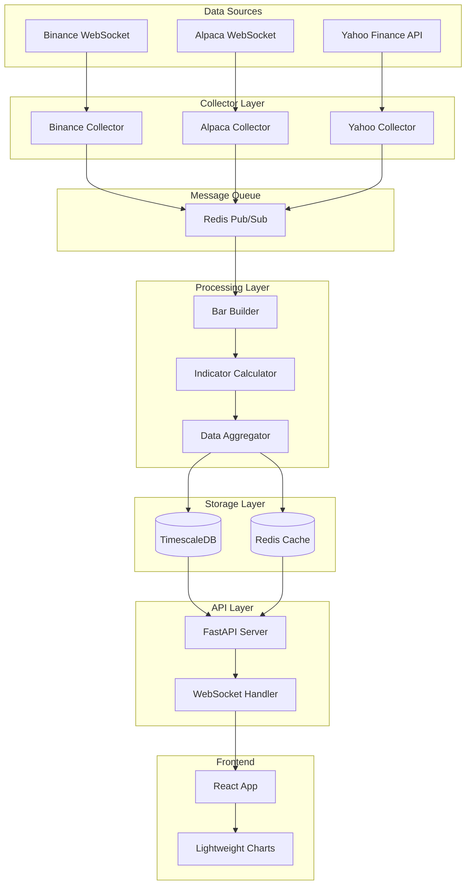
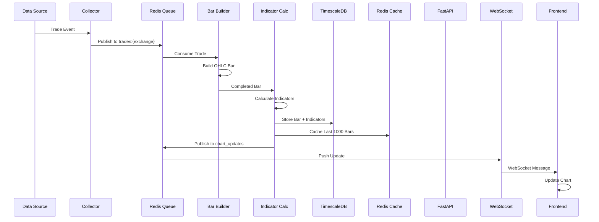

# Design Document

## Overview

Crypto-Stock Platform, mikroservis mimarisine dayalı, event-driven bir finansal veri toplama ve görselleştirme platformudur. Platform, üç farklı veri kaynağından (Binance, Alpaca, Yahoo Finance) real-time ve gecikmeli veri toplayarak, bu verileri işleyip TimescaleDB'de saklayacak, Redis üzerinden cache'leyecek ve WebSocket ile frontend'e push edecektir.

### High-Level Architecture

```
┌─────────────────────────────────────────────────────────────────┐
│                         Data Sources                             │
│  ┌──────────┐      ┌──────────┐      ┌──────────────┐          │
│  │ Binance  │      │ Alpaca   │      │ Yahoo Finance│          │
│  │WebSocket │      │WebSocket │      │  REST API    │          │
│  └────┬─────┘      └────┬─────┘      └──────┬───────┘          │
└───────┼─────────────────┼────────────────────┼──────────────────┘
        │                 │                    │
        ▼                 ▼                    ▼
┌─────────────────────────────────────────────────────────────────┐
│                      Collector Layer                             │
│  ┌──────────────┐  ┌──────────────┐  ┌──────────────┐          │
│  │   Binance    │  │   Alpaca     │  │    Yahoo     │          │
│  │  Collector   │  │  Collector   │  │  Collector   │          │
│  └──────┬───────┘  └──────┬───────┘  └──────┬───────┘          │
└─────────┼──────────────────┼──────────────────┼──────────────────┘
          │                  │                  │
          └──────────────────┼──────────────────┘
                             ▼
                    ┌────────────────┐
                    │  Redis Queue   │
                    │   (Pub/Sub)    │
                    └────────┬───────┘
                             │
                             ▼
┌─────────────────────────────────────────────────────────────────┐
│                     Processing Layer                             │
│  ┌──────────────┐  ┌──────────────┐  ┌──────────────┐          │
│  │ Bar Builder  │  │  Indicator   │  │    Data      │          │
│  │              │─▶│  Calculator  │─▶│ Aggregator   │          │
│  └──────────────┘  └──────────────┘  └──────┬───────┘          │
└─────────────────────────────────────────────┼──────────────────┘
                             │
          ┌──────────────────┴──────────────────┐
          ▼                                     ▼
┌──────────────────┐                  ┌──────────────────┐
│  TimescaleDB     │                  │   Redis Cache    │
│  (Persistent)    │                  │  (Hot Data)      │
└──────────┬───────┘                  └────────┬─────────┘
           │                                   │
           └───────────────┬───────────────────┘
                           ▼
                  ┌────────────────┐
                  │   FastAPI      │
                  │  REST + WS     │
                  └────────┬───────┘
                           │
                           ▼
                  ┌────────────────┐
                  │  React + TS    │
                  │ Lightweight    │
                  │    Charts      │
                  └────────────────┘
```

### Design Principles

1. **Separation of Concerns**: Her component tek bir sorumluluğa sahip (collector, processor, storage, API, UI)
2. **Event-Driven Architecture**: Redis Pub/Sub ile loosely coupled components
3. **Async-First**: Python asyncio ile non-blocking I/O operations
4. **Scalability**: Horizontal scaling için stateless collectors ve processors
5. **Resilience**: Automatic reconnection, circuit breakers, graceful degradation
6. **Performance**: Redis cache, batch operations, vectorized calculations
7. **Observability**: Structured logging, health checks, metrics

## Architecture

### Component Diagram



### Data Flow Sequence



## Components and Interfaces

### 1. Collector Layer

#### Base Collector (Abstract Class)

```python
from abc import ABC, abstractmethod
from typing import Dict, List, Optional
import asyncio

class BaseCollector(ABC):
    """
    Abstract base class for all data collectors.
    Provides common functionality for connection management,
    error handling, and data publishing.
    """
    
    def __init__(self, config: Dict, redis_client):
        self.config = config
        self.redis = redis_client
        self.is_running = False
        self.reconnect_delay = 1  # exponential backoff
        self.max_reconnect_delay = 60
        
    @abstractmethod
    async def connect(self) -> None:
        """Establish connection to data source"""
        pass
        
    @abstractmethod
    async def subscribe(self, symbols: List[str]) -> None:
        """Subscribe to symbol streams"""
        pass
        
    @abstractmethod
    async def handle_message(self, message: Dict) -> None:
        """Process incoming message"""
        pass
        
    async def publish_trade(self, trade_data: Dict) -> None:
        """Publish trade to Redis queue"""
        await self.redis.publish(
            f"trades:{self.config['exchange']}", 
            json.dumps(trade_data)
        )
        
    async def reconnect(self) -> None:
        """Reconnect with exponential backoff"""
        await asyncio.sleep(self.reconnect_delay)
        self.reconnect_delay = min(
            self.reconnect_delay * 2, 
            self.max_reconnect_delay
        )
        await self.connect()
        
    async def start(self) -> None:
        """Start collector with auto-reconnect"""
        self.is_running = True
        while self.is_running:
            try:
                await self.connect()
                await self.run()
            except Exception as e:
                logger.error(f"Collector error: {e}")
                await self.reconnect()
```

**Interface Contract:**
- Input: Configuration (API keys, symbols, timeframes)
- Output: Publishes to Redis `trades:{exchange}` channel
- Error Handling: Auto-reconnect with exponential backoff
- Logging: All connection events, errors, and trade counts

#### Binance Collector

```python
from binance import AsyncClient, BinanceSocketManager
from collectors.base_collector import BaseCollector

class BinanceCollector(BaseCollector):
    """
    Collects real-time trade and kline data from Binance WebSocket.
    Handles connection refresh every 24 hours.
    """
    
    async def connect(self) -> None:
        self.client = await AsyncClient.create(
            api_key=self.config['api_key'],
            api_secret=self.config['api_secret']
        )
        self.bsm = BinanceSocketManager(self.client)
        
    async def subscribe(self, symbols: List[str]) -> None:
        # Subscribe to trade streams
        self.trade_socket = self.bsm.multiplex_socket([
            f"{symbol.lower()}@trade" for symbol in symbols
        ])
        
        # Subscribe to kline streams (1m, 5m, 15m, 1h)
        self.kline_socket = self.bsm.multiplex_socket([
            f"{symbol.lower()}@kline_{tf}" 
            for symbol in symbols 
            for tf in ['1m', '5m', '15m', '1h']
        ])
        
    async def handle_message(self, message: Dict) -> None:
        if message['e'] == 'trade':
            trade_data = {
                'exchange': 'binance',
                'symbol': message['s'],
                'price': float(message['p']),
                'quantity': float(message['q']),
                'timestamp': message['T'],
                'is_buyer_maker': message['m']
            }
            await self.publish_trade(trade_data)
            
    async def fetch_historical(self, symbol: str, interval: str, 
                               start_time: int, end_time: int) -> List[Dict]:
        """Fetch historical klines from REST API"""
        klines = await self.client.get_historical_klines(
            symbol, interval, start_time, end_time
        )
        return self._parse_klines(klines)
```

**Binance-Specific Features:**
- 24-hour connection refresh timer
- Rate limit tracking (1200 req/min for REST)
- Multi-symbol WebSocket multiplexing
- Historical data backfill via REST API

#### Alpaca Collector

```python
from alpaca_trade_api.stream import Stream
from collectors.base_collector import BaseCollector

class AlpacaCollector(BaseCollector):
    """
    Collects real-time US stock data from Alpaca WebSocket.
    Handles market hours and reconnection during market close.
    """
    
    async def connect(self) -> None:
        self.stream = Stream(
            key_id=self.config['api_key'],
            secret_key=self.config['secret_key'],
            data_feed='iex'  # or 'sip' for paid
        )
        
    async def subscribe(self, symbols: List[str]) -> None:
        # Subscribe to trades, quotes, and bars
        self.stream.subscribe_trades(
            self._handle_trade, *symbols
        )
        self.stream.subscribe_bars(
            self._handle_bar, *symbols
        )
        
    async def _handle_trade(self, trade):
        if not self._is_market_hours():
            return
            
        trade_data = {
            'exchange': 'alpaca',
            'symbol': trade.symbol,
            'price': float(trade.price),
            'quantity': float(trade.size),
            'timestamp': int(trade.timestamp.timestamp() * 1000)
        }
        await self.publish_trade(trade_data)
        
    def _is_market_hours(self) -> bool:
        """Check if NYSE/NASDAQ is open (09:30-16:00 ET)"""
        now = datetime.now(pytz.timezone('US/Eastern'))
        if now.weekday() >= 5:  # Weekend
            return False
        market_open = now.replace(hour=9, minute=30, second=0)
        market_close = now.replace(hour=16, minute=0, second=0)
        return market_open <= now <= market_close
```

**Alpaca-Specific Features:**
- Market hours detection (NYSE/NASDAQ)
- Graceful handling of market close
- Support for IEX (free) and SIP (paid) data feeds
- Trade, quote, and bar stream subscriptions

#### Yahoo Finance Collector

```python
import yfinance as yf
from collectors.base_collector import BaseCollector

class YahooCollector(BaseCollector):
    """
    Polls Yahoo Finance API every 5 minutes for BIST stocks.
    Implements rate limiting and exponential backoff.
    """
    
    async def connect(self) -> None:
        self.polling_interval = 300  # 5 minutes
        self.symbols = self.config['symbols']
        
    async def run(self) -> None:
        while self.is_running:
            if self._is_market_hours():
                await self._poll_data()
            else:
                await asyncio.sleep(self.polling_interval * 2)
            await asyncio.sleep(self.polling_interval)
            
    async def _poll_data(self) -> None:
        for symbol in self.symbols:
            try:
                ticker = yf.Ticker(symbol)
                data = ticker.history(period='1d', interval='1m')
                
                if not data.empty:
                    latest = data.iloc[-1]
                    bar_data = {
                        'exchange': 'yahoo',
                        'symbol': symbol,
                        'timestamp': int(data.index[-1].timestamp() * 1000),
                        'open': float(latest['Open']),
                        'high': float(latest['High']),
                        'low': float(latest['Low']),
                        'close': float(latest['Close']),
                        'volume': float(latest['Volume'])
                    }
                    await self.publish_trade(bar_data)
                    
            except Exception as e:
                logger.error(f"Yahoo polling error for {symbol}: {e}")
                await asyncio.sleep(10)  # backoff
                
    def _is_market_hours(self) -> bool:
        """Check if BIST is open (09:40-18:10 TRT)"""
        now = datetime.now(pytz.timezone('Europe/Istanbul'))
        if now.weekday() >= 5:
            return False
        market_open = now.replace(hour=9, minute=40, second=0)
        market_close = now.replace(hour=18, minute=10, second=0)
        return market_open <= now <= market_close
```

**Yahoo-Specific Features:**
- 5-minute polling interval
- BIST market hours detection (TRT timezone)
- Rate limit handling with exponential backoff
- Direct OHLC data (no tick-to-bar conversion needed)

### 2. Processing Layer

#### Bar Builder

```python
from typing import Dict, Optional
from datetime import datetime, timedelta
import asyncio

class BarBuilder:
    """
    Converts individual trade ticks into OHLC candlestick bars.
    Maintains current bars in memory and completes them on time bucket boundaries.
    """
    
    def __init__(self, redis_client, db_manager):
        self.redis = redis_client
        self.db = db_manager
        self.current_bars: Dict[str, Dict] = {}  # {symbol_tf: bar_data}
        self.timeframes = ['1m', '5m', '15m', '1h']
        
    async def process_trade(self, trade: Dict) -> None:
        """Process incoming trade and update bars"""
        symbol = trade['symbol']
        timestamp = trade['timestamp']
        price = trade['price']
        quantity = trade['quantity']
        
        # Process 1-minute bar
        bar_key = f"{symbol}_1m"
        bucket_time = self._get_bucket_time(timestamp, '1m')
        
        if bar_key not in self.current_bars:
            self.current_bars[bar_key] = self._init_bar(
                symbol, bucket_time, price, quantity
            )
        else:
            current_bar = self.current_bars[bar_key]
            
            # Check if we need to complete current bar
            if bucket_time > current_bar['time']:
                await self._complete_bar(current_bar)
                self.current_bars[bar_key] = self._init_bar(
                    symbol, bucket_time, price, quantity
                )
            else:
                # Update current bar
                current_bar['high'] = max(current_bar['high'], price)
                current_bar['low'] = min(current_bar['low'], price)
                current_bar['close'] = price
                current_bar['volume'] += quantity
                
        # Update Redis with current bar
        await self._update_redis_current_bar(bar_key, self.current_bars[bar_key])
        
    def _get_bucket_time(self, timestamp: int, timeframe: str) -> int:
        """Round timestamp down to timeframe bucket"""
        dt = datetime.fromtimestamp(timestamp / 1000)
        
        if timeframe == '1m':
            dt = dt.replace(second=0, microsecond=0)
        elif timeframe == '5m':
            dt = dt.replace(minute=(dt.minute // 5) * 5, second=0, microsecond=0)
        elif timeframe == '15m':
            dt = dt.replace(minute=(dt.minute // 15) * 15, second=0, microsecond=0)
        elif timeframe == '1h':
            dt = dt.replace(minute=0, second=0, microsecond=0)
            
        return int(dt.timestamp() * 1000)
        
    def _init_bar(self, symbol: str, time: int, price: float, volume: float) -> Dict:
        """Initialize new bar"""
        return {
            'symbol': symbol,
            'time': time,
            'open': price,
            'high': price,
            'low': price,
            'close': price,
            'volume': volume,
            'completed': False
        }
        
    async def _complete_bar(self, bar: Dict) -> None:
        """Mark bar as completed and trigger processing"""
        bar['completed'] = True
        
        # Store in TimescaleDB
        await self.db.insert_candle(bar)
        
        # Publish to indicator calculator
        await self.redis.publish('completed_bars', json.dumps(bar))
        
        logger.info(f"Completed bar: {bar['symbol']} at {bar['time']}")
        
    async def aggregate_higher_timeframes(self, symbol: str) -> None:
        """Aggregate 1m bars into 5m, 15m, 1h bars"""
        for tf in ['5m', '15m', '1h']:
            bars_1m = await self.db.get_recent_candles(symbol, '1m', limit=60)
            aggregated = self._aggregate_bars(bars_1m, tf)
            
            for bar in aggregated:
                await self.db.insert_candle(bar)
                await self.redis.publish('completed_bars', json.dumps(bar))
```

**Bar Builder Design Decisions:**
- In-memory current bars for low latency
- Time bucket rounding for consistent bar alignment
- Automatic completion on bucket boundary
- Support for multiple timeframes via aggregation
- Redis pub/sub for downstream processing

#### Indicator Calculator

```python
import talib
import numpy as np
import pandas as pd
from typing import Dict, List

class IndicatorCalculator:
    """
    Calculates technical indicators using TA-Lib.
    Uses rolling window for memory efficiency.
    """
    
    def __init__(self, redis_client, db_manager):
        self.redis = redis_client
        self.db = db_manager
        self.window_size = 200  # bars for calculation
        
    async def process_completed_bar(self, bar: Dict) -> None:
        """Calculate indicators for completed bar"""
        symbol = bar['symbol']
        timeframe = bar.get('timeframe', '1m')
        
        # Fetch recent bars for calculation
        recent_bars = await self.db.get_recent_candles(
            symbol, timeframe, limit=self.window_size
        )
        
        if len(recent_bars) < 20:  # Minimum for most indicators
            logger.warning(f"Insufficient data for {symbol}")
            return
            
        # Convert to pandas DataFrame
        df = pd.DataFrame(recent_bars)
        
        # Calculate indicators
        indicators = self._calculate_all_indicators(df)
        
        # Store in database
        await self.db.insert_indicators(symbol, bar['time'], indicators)
        
        # Cache in Redis
        await self._cache_indicators(symbol, indicators)
        
        # Publish update
        await self.redis.publish('chart_updates', json.dumps({
            'symbol': symbol,
            'time': bar['time'],
            'bar': bar,
            'indicators': indicators
        }))
        
    def _calculate_all_indicators(self, df: pd.DataFrame) -> Dict:
        """Calculate all technical indicators"""
        close = df['close'].values
        high = df['high'].values
        low = df['low'].values
        volume = df['volume'].values
        
        indicators = {}
        
        # RSI
        indicators['rsi_14'] = talib.RSI(close, timeperiod=14)[-1]
        
        # MACD
        macd, signal, hist = talib.MACD(close, 
            fastperiod=12, slowperiod=26, signalperiod=9)
        indicators['macd'] = macd[-1]
        indicators['macd_signal'] = signal[-1]
        indicators['macd_hist'] = hist[-1]
        
        # Bollinger Bands
        upper, middle, lower = talib.BBANDS(close, 
            timeperiod=20, nbdevup=2, nbdevdn=2)
        indicators['bb_upper'] = upper[-1]
        indicators['bb_middle'] = middle[-1]
        indicators['bb_lower'] = lower[-1]
        
        # Moving Averages
        indicators['sma_20'] = talib.SMA(close, timeperiod=20)[-1]
        indicators['sma_50'] = talib.SMA(close, timeperiod=50)[-1]
        indicators['sma_100'] = talib.SMA(close, timeperiod=100)[-1]
        indicators['sma_200'] = talib.SMA(close, timeperiod=200)[-1]
        
        indicators['ema_12'] = talib.EMA(close, timeperiod=12)[-1]
        indicators['ema_26'] = talib.EMA(close, timeperiod=26)[-1]
        indicators['ema_50'] = talib.EMA(close, timeperiod=50)[-1]
        
        # VWAP (calculated manually)
        indicators['vwap'] = self._calculate_vwap(df)
        
        # Stochastic
        slowk, slowd = talib.STOCH(high, low, close,
            fastk_period=14, slowk_period=3, slowd_period=3)
        indicators['stoch_k'] = slowk[-1]
        indicators['stoch_d'] = slowd[-1]
        
        # Volume SMA
        indicators['volume_sma'] = talib.SMA(volume, timeperiod=20)[-1]
        
        return indicators
        
    def _calculate_vwap(self, df: pd.DataFrame) -> float:
        """Calculate Volume Weighted Average Price"""
        typical_price = (df['high'] + df['low'] + df['close']) / 3
        return (typical_price * df['volume']).sum() / df['volume'].sum()
```

**Indicator Calculator Design Decisions:**
- TA-Lib for industry-standard calculations
- Rolling window (200 bars) for memory efficiency
- Vectorized operations with pandas/numpy
- Redis caching with TTL for fast access
- Pub/sub notification for real-time updates

### 3. Storage Layer

#### TimescaleDB Manager

```python
import asyncpg
from typing import List, Dict, Optional

class TimescaleManager:
    """
    Manages TimescaleDB operations for time-series data.
    Implements connection pooling and batch inserts.
    """
    
    def __init__(self, config: Dict):
        self.config = config
        self.pool: Optional[asyncpg.Pool] = None
        
    async def connect(self) -> None:
        """Create connection pool"""
        self.pool = await asyncpg.create_pool(
            host=self.config['host'],
            port=self.config['port'],
            database=self.config['database'],
            user=self.config['user'],
            password=self.config['password'],
            min_size=10,
            max_size=50
        )
        
    async def insert_candle(self, bar: Dict) -> None:
        """Insert single candle"""
        async with self.pool.acquire() as conn:
            await conn.execute("""
                INSERT INTO candles (time, symbol, exchange, timeframe, 
                                    open, high, low, close, volume)
                VALUES ($1, $2, $3, $4, $5, $6, $7, $8, $9)
                ON CONFLICT (time, symbol, exchange, timeframe) DO UPDATE
                SET open = EXCLUDED.open,
                    high = EXCLUDED.high,
                    low = EXCLUDED.low,
                    close = EXCLUDED.close,
                    volume = EXCLUDED.volume
            """, 
                bar['time'], bar['symbol'], bar['exchange'], 
                bar.get('timeframe', '1m'),
                bar['open'], bar['high'], bar['low'], 
                bar['close'], bar['volume']
            )
            
    async def batch_insert_candles(self, bars: List[Dict]) -> None:
        """Batch insert for high throughput"""
        async with self.pool.acquire() as conn:
            await conn.executemany("""
                INSERT INTO candles (time, symbol, exchange, timeframe,
                                    open, high, low, close, volume)
                VALUES ($1, $2, $3, $4, $5, $6, $7, $8, $9)
                ON CONFLICT (time, symbol, exchange, timeframe) DO NOTHING
            """, [
                (b['time'], b['symbol'], b['exchange'], b.get('timeframe', '1m'),
                 b['open'], b['high'], b['low'], b['close'], b['volume'])
                for b in bars
            ])
            
    async def get_recent_candles(self, symbol: str, timeframe: str, 
                                 limit: int = 200) -> List[Dict]:
        """Fetch recent candles for indicator calculation"""
        async with self.pool.acquire() as conn:
            rows = await conn.fetch("""
                SELECT time, open, high, low, close, volume
                FROM candles
                WHERE symbol = $1 AND timeframe = $2
                ORDER BY time DESC
                LIMIT $3
            """, symbol, timeframe, limit)
            
            return [dict(row) for row in reversed(rows)]
            
    async def insert_indicators(self, symbol: str, time: int, 
                               indicators: Dict) -> None:
        """Insert calculated indicators"""
        async with self.pool.acquire() as conn:
            await conn.execute("""
                INSERT INTO indicators (time, symbol, rsi_14, macd, macd_signal,
                    macd_hist, bb_upper, bb_middle, bb_lower, sma_20, sma_50,
                    ema_12, ema_26, volume_sma, stoch_k, stoch_d)
                VALUES ($1, $2, $3, $4, $5, $6, $7, $8, $9, $10, $11, $12, $13, $14, $15, $16)
                ON CONFLICT (time, symbol) DO UPDATE
                SET rsi_14 = EXCLUDED.rsi_14,
                    macd = EXCLUDED.macd,
                    macd_signal = EXCLUDED.macd_signal,
                    macd_hist = EXCLUDED.macd_hist,
                    bb_upper = EXCLUDED.bb_upper,
                    bb_middle = EXCLUDED.bb_middle,
                    bb_lower = EXCLUDED.bb_lower,
                    sma_20 = EXCLUDED.sma_20,
                    sma_50 = EXCLUDED.sma_50,
                    ema_12 = EXCLUDED.ema_12,
                    ema_26 = EXCLUDED.ema_26,
                    volume_sma = EXCLUDED.volume_sma,
                    stoch_k = EXCLUDED.stoch_k,
                    stoch_d = EXCLUDED.stoch_d
            """, time, symbol, indicators.get('rsi_14'), indicators.get('macd'),
                indicators.get('macd_signal'), indicators.get('macd_hist'),
                indicators.get('bb_upper'), indicators.get('bb_middle'),
                indicators.get('bb_lower'), indicators.get('sma_20'),
                indicators.get('sma_50'), indicators.get('ema_12'),
                indicators.get('ema_26'), indicators.get('volume_sma'),
                indicators.get('stoch_k'), indicators.get('stoch_d')
            )
```

**Database Schema:**

```sql
-- Candles hypertable
CREATE TABLE candles (
    time TIMESTAMPTZ NOT NULL,
    symbol VARCHAR(20) NOT NULL,
    exchange VARCHAR(20) NOT NULL,
    timeframe VARCHAR(5) NOT NULL,
    open NUMERIC(20,8),
    high NUMERIC(20,8),
    low NUMERIC(20,8),
    close NUMERIC(20,8),
    volume NUMERIC(20,8),
    PRIMARY KEY (time, symbol, exchange, timeframe)
);

SELECT create_hypertable('candles', 'time');
CREATE INDEX idx_candles_symbol_time ON candles (symbol, time DESC);
CREATE INDEX idx_candles_exchange ON candles (exchange, time DESC);

-- Retention policy
SELECT add_retention_policy('candles', INTERVAL '365 days');

-- Indicators hypertable
CREATE TABLE indicators (
    time TIMESTAMPTZ NOT NULL,
    symbol VARCHAR(20) NOT NULL,
    rsi_14 NUMERIC(10,4),
    macd NUMERIC(10,4),
    macd_signal NUMERIC(10,4),
    macd_hist NUMERIC(10,4),
    bb_upper NUMERIC(20,8),
    bb_middle NUMERIC(20,8),
    bb_lower NUMERIC(20,8),
    sma_20 NUMERIC(20,8),
    sma_50 NUMERIC(20,8),
    ema_12 NUMERIC(20,8),
    ema_26 NUMERIC(20,8),
    volume_sma NUMERIC(20,8),
    stoch_k NUMERIC(10,4),
    stoch_d NUMERIC(10,4),
    PRIMARY KEY (time, symbol)
);

SELECT create_hypertable('indicators', 'time');
CREATE INDEX idx_indicators_symbol_time ON indicators (symbol, time DESC);

-- Retention policy
SELECT add_retention_policy('indicators', INTERVAL '365 days');
```

#### Redis Cache Manager

```python
import redis.asyncio as redis
import json
from typing import Dict, List, Optional

class RedisCacheManager:
    """
    Manages Redis caching and pub/sub operations.
    Implements hot data caching and real-time messaging.
    """
    
    def __init__(self, config: Dict):
        self.config = config
        self.client: Optional[redis.Redis] = None
        
    async def connect(self) -> None:
        """Create Redis connection"""
        self.client = await redis.from_url(
            f"redis://{self.config['host']}:{self.config['port']}",
            encoding="utf-8",
            decode_responses=True
        )
        
    async def cache_bars(self, symbol: str, bars: List[Dict], 
                        max_bars: int = 1000) -> None:
        """Cache last N bars for symbol"""
        key = f"chart:{symbol}"
        
        # Store as sorted set with timestamp as score
        pipeline = self.client.pipeline()
        for bar in bars:
            pipeline.zadd(key, {json.dumps(bar): bar['time']})
        
        # Keep only last max_bars
        pipeline.zremrangebyrank(key, 0, -(max_bars + 1))
        pipeline.expire(key, 3600)  # 1 hour TTL
        
        await pipeline.execute()
        
    async def get_cached_bars(self, symbol: str, limit: int = 1000) -> List[Dict]:
        """Retrieve cached bars"""
        key = f"chart:{symbol}"
        bars_json = await self.client.zrange(key, -limit, -1)
        return [json.loads(b) for b in bars_json]
        
    async def cache_indicators(self, symbol: str, indicators: Dict, 
                              ttl: int = 300) -> None:
        """Cache calculated indicators"""
        key = f"indicators:{symbol}"
        await self.client.hset(key, mapping=indicators)
        await self.client.expire(key, ttl)
        
    async def publish(self, channel: str, message: str) -> None:
        """Publish message to channel"""
        await self.client.publish(channel, message)
        
    async def subscribe(self, channel: str, handler):
        """Subscribe to channel with handler"""
        pubsub = self.client.pubsub()
        await pubsub.subscribe(channel)
        
        async for message in pubsub.listen():
            if message['type'] == 'message':
                await handler(message['data'])
```

**Redis Data Structures:**
- `chart:{symbol}` - Sorted set of last 1000 bars (score = timestamp)
- `indicators:{symbol}` - Hash of calculated indicators (TTL = 5 min)
- `trades:{exchange}` - Pub/Sub channel for raw trades
- `completed_bars` - Pub/Sub channel for completed bars
- `chart_updates` - Pub/Sub channel for frontend updates
- `system:health` - Hash of collector health status

### 4. API Layer

#### FastAPI Application

```python
from fastapi import FastAPI, WebSocket, HTTPException, Query
from fastapi.middleware.cors import CORSMiddleware
from typing import List, Optional
import asyncio

app = FastAPI(
    title="Crypto-Stock Platform API",
    version="1.0.0",
    description="Real-time financial data API"
)

# CORS configuration
app.add_middleware(
    CORSMiddleware,
    allow_origins=["http://localhost:3000"],  # Frontend URL
    allow_credentials=True,
    allow_methods=["*"],
    allow_headers=["*"],
)

# Dependency injection
db_manager = TimescaleManager(config['database'])
redis_manager = RedisCacheManager(config['redis'])


@app.on_event("startup")
async def startup():
    await db_manager.connect()
    await redis_manager.connect()

@app.get("/api/symbols")
async def get_symbols():
    """Get list of available symbols grouped by exchange"""
    return {
        "binance": ["BTC/USDT", "ETH/USDT", "SOL/USDT", "BNB/USDT", "ADA/USDT"],
        "alpaca": ["AAPL", "TSLA", "NVDA", "MSFT", "GOOGL", "AMZN", "META"],
        "yahoo": ["THYAO.IS", "GARAN.IS", "ISCTR.IS", "AKBNK.IS", "SISE.IS"]
    }

@app.get("/api/charts/{symbol}")
async def get_chart_data(
    symbol: str,
    timeframe: str = Query("1m", regex="^(1m|5m|15m|1h|4h|1d)$"),
    limit: int = Query(1000, ge=1, le=5000)
):
    """Get historical chart data with indicators"""
    
    # Try cache first
    cached_bars = await redis_manager.get_cached_bars(symbol, limit)
    
    if cached_bars:
        bars = cached_bars
    else:
        # Fallback to database
        bars = await db_manager.get_recent_candles(symbol, timeframe, limit)
        await redis_manager.cache_bars(symbol, bars)
    
    # Get indicators
    indicators = []
    for bar in bars:
        ind = await db_manager.get_indicators(symbol, bar['time'])
        indicators.append(ind)
    
    return {
        "symbol": symbol,
        "timeframe": timeframe,
        "bars": bars,
        "indicators": indicators
    }

@app.get("/api/health")
async def health_check():
    """System health check"""
    db_healthy = await db_manager.pool is not None
    redis_healthy = await redis_manager.client.ping()
    
    return {
        "status": "healthy" if (db_healthy and redis_healthy) else "degraded",
        "database": "up" if db_healthy else "down",
        "redis": "up" if redis_healthy else "down"
    }
```

#### WebSocket Handler

```python
from fastapi import WebSocket, WebSocketDisconnect
from typing import Set, Dict
import json

class ConnectionManager:
    """Manages WebSocket connections and subscriptions"""
    
    def __init__(self):
        self.active_connections: Dict[str, Set[WebSocket]] = {}
        
    async def connect(self, websocket: WebSocket, symbol: str):
        """Accept connection and add to symbol subscription"""
        await websocket.accept()
        
        if symbol not in self.active_connections:
            self.active_connections[symbol] = set()
        
        self.active_connections[symbol].add(websocket)
        
    def disconnect(self, websocket: WebSocket, symbol: str):
        """Remove connection"""
        if symbol in self.active_connections:
            self.active_connections[symbol].discard(websocket)
            
    async def broadcast(self, symbol: str, message: dict):
        """Broadcast message to all subscribers of symbol"""
        if symbol not in self.active_connections:
            return
            
        disconnected = set()
        for connection in self.active_connections[symbol]:
            try:
                await connection.send_json(message)
            except:
                disconnected.add(connection)
        
        # Clean up disconnected clients
        self.active_connections[symbol] -= disconnected

manager = ConnectionManager()

@app.websocket("/ws/{symbol}")
async def websocket_endpoint(websocket: WebSocket, symbol: str):
    """WebSocket endpoint for real-time updates"""
    await manager.connect(websocket, symbol)
    
    try:
        # Send initial data
        initial_data = await get_chart_data(symbol, "1m", 1000)
        await websocket.send_json({
            "type": "initial",
            "data": initial_data
        })
        
        # Listen for updates from Redis
        async def handle_update(message: str):
            data = json.loads(message)
            if data['symbol'] == symbol:
                await manager.broadcast(symbol, {
                    "type": "update",
                    "data": data
                })
        
        # Subscribe to Redis channel
        await redis_manager.subscribe('chart_updates', handle_update)
        
        # Keep connection alive
        while True:
            await websocket.receive_text()
            
    except WebSocketDisconnect:
        manager.disconnect(websocket, symbol)
```

**API Design Decisions:**
- RESTful endpoints for historical data
- WebSocket for real-time updates
- Redis cache-first strategy
- CORS configuration for frontend
- Health check endpoint for monitoring
- Connection pooling for database
- Broadcast pattern for multiple clients

## Data Models

### Pydantic Schemas

```python
from pydantic import BaseModel, Field
from typing import Optional, List
from datetime import datetime

class Trade(BaseModel):
    """Raw trade event"""
    exchange: str
    symbol: str
    price: float
    quantity: float
    timestamp: int
    is_buyer_maker: Optional[bool] = None


class Candle(BaseModel):
    """OHLC candlestick bar"""
    time: int
    symbol: str
    exchange: str
    timeframe: str = "1m"
    open: float
    high: float
    low: float
    close: float
    volume: float
    completed: bool = False

class Indicators(BaseModel):
    """Technical indicators"""
    time: int
    symbol: str
    rsi_14: Optional[float] = None
    macd: Optional[float] = None
    macd_signal: Optional[float] = None
    macd_hist: Optional[float] = None
    bb_upper: Optional[float] = None
    bb_middle: Optional[float] = None
    bb_lower: Optional[float] = None
    sma_20: Optional[float] = None
    sma_50: Optional[float] = None
    sma_100: Optional[float] = None
    sma_200: Optional[float] = None
    ema_12: Optional[float] = None
    ema_26: Optional[float] = None
    ema_50: Optional[float] = None
    vwap: Optional[float] = None
    stoch_k: Optional[float] = None
    stoch_d: Optional[float] = None
    volume_sma: Optional[float] = None

class ChartData(BaseModel):
    """Complete chart data response"""
    symbol: str
    timeframe: str
    bars: List[Candle]
    indicators: List[Indicators]

class WebSocketMessage(BaseModel):
    """WebSocket message format"""
    type: str  # 'initial', 'update', 'error'
    data: dict
```

## Error Handling

### Error Handling Strategy

1. **Collector Errors:**
   - WebSocket disconnect → Auto-reconnect with exponential backoff
   - API rate limit → Queue requests and throttle
   - Invalid data → Log and skip, don't crash
   - Network timeout → Retry with backoff

2. **Processing Errors:**
   - Insufficient data for indicators → Return null values
   - Database write failure → Retry with exponential backoff
   - Redis connection loss → Fallback to database

3. **API Errors:**
   - Invalid parameters → 400 Bad Request
   - Symbol not found → 404 Not Found
   - Database unavailable → 503 Service Unavailable
   - Rate limit exceeded → 429 Too Many Requests

4. **Frontend Errors:**
   - WebSocket disconnect → Auto-reconnect with visual indicator
   - API timeout → Show error message, retry
   - Chart rendering error → Fallback to loading state

### Logging Configuration

```python
from loguru import logger
import sys

# Configure loguru
logger.remove()
logger.add(
    sys.stdout,
    format="<green>{time:YYYY-MM-DD HH:mm:ss}</green> | <level>{level: <8}</level> | <cyan>{name}</cyan>:<cyan>{function}</cyan> - <level>{message}</level>",
    level="INFO"
)

logger.add(
    "logs/app_{time:YYYY-MM-DD}.log",
    rotation="1 day",
    retention="30 days",
    compression="zip",
    level="DEBUG"
)
```

## Testing Strategy

### Unit Tests

```python
# Test bar builder
def test_bar_builder_tick_processing():
    builder = BarBuilder(mock_redis, mock_db)
    trade = {
        'symbol': 'BTC/USDT',
        'price': 50000.0,
        'quantity': 0.1,
        'timestamp': 1234567890000
    }
    await builder.process_trade(trade)
    assert 'BTC/USDT_1m' in builder.current_bars

# Test indicator calculation
def test_indicator_calculator():
    calc = IndicatorCalculator(mock_redis, mock_db)
    bars = generate_test_bars(100)
    indicators = calc._calculate_all_indicators(pd.DataFrame(bars))
    assert 'rsi_14' in indicators
    assert 0 <= indicators['rsi_14'] <= 100
```

### Integration Tests

```python
# Test end-to-end data flow
@pytest.mark.asyncio
async def test_data_flow():
    # Start collector
    collector = BinanceCollector(config, redis)
    await collector.connect()
    
    # Simulate trade
    trade = create_test_trade()
    await collector.publish_trade(trade)
    
    # Verify bar creation
    await asyncio.sleep(1)
    bars = await db.get_recent_candles('BTC/USDT', '1m', 1)
    assert len(bars) > 0
```

### Performance Tests

```python
# Test database write throughput
@pytest.mark.benchmark
async def test_batch_insert_performance():
    bars = [create_test_bar() for _ in range(10000)]
    start = time.time()
    await db.batch_insert_candles(bars)
    duration = time.time() - start
    assert duration < 1.0  # Should complete in < 1 second
```

## Deployment Architecture

### Docker Compose Setup

```yaml
version: '3.8'

services:
  timescaledb:
    image: timescale/timescaledb:latest-pg14
    environment:
      POSTGRES_DB: crypto_stock
      POSTGRES_USER: admin
      POSTGRES_PASSWORD: ${DB_PASSWORD}
    volumes:
      - timescale_data:/var/lib/postgresql/data
    ports:
      - "5432:5432"

  redis:
    image: redis:7-alpine
    ports:
      - "6379:6379"
    volumes:
      - redis_data:/data

  binance_collector:
    build:
      context: .
      dockerfile: docker/Dockerfile.collector
    environment:
      COLLECTOR_TYPE: binance
      BINANCE_API_KEY: ${BINANCE_API_KEY}
      BINANCE_API_SECRET: ${BINANCE_API_SECRET}
    depends_on:
      - redis
      - timescaledb

  alpaca_collector:
    build:
      context: .
      dockerfile: docker/Dockerfile.collector
    environment:
      COLLECTOR_TYPE: alpaca
      ALPACA_API_KEY: ${ALPACA_API_KEY}
      ALPACA_SECRET_KEY: ${ALPACA_SECRET_KEY}
    depends_on:
      - redis
      - timescaledb

  yahoo_collector:
    build:
      context: .
      dockerfile: docker/Dockerfile.collector
    environment:
      COLLECTOR_TYPE: yahoo
    depends_on:
      - redis
      - timescaledb

  processor:
    build:
      context: .
      dockerfile: docker/Dockerfile.processor
    depends_on:
      - redis
      - timescaledb

  api:
    build:
      context: .
      dockerfile: docker/Dockerfile.api
    ports:
      - "8000:8000"
    depends_on:
      - redis
      - timescaledb

  frontend:
    build:
      context: ./frontend
      dockerfile: Dockerfile
    ports:
      - "3000:80"
    depends_on:
      - api

volumes:
  timescale_data:
  redis_data:
```

### Environment Configuration

```bash
# .env.example
DB_HOST=timescaledb
DB_PORT=5432
DB_NAME=crypto_stock
DB_USER=admin
DB_PASSWORD=your_secure_password

REDIS_HOST=redis
REDIS_PORT=6379

BINANCE_API_KEY=your_binance_key
BINANCE_API_SECRET=your_binance_secret

ALPACA_API_KEY=your_alpaca_key
ALPACA_SECRET_KEY=your_alpaca_secret

API_HOST=0.0.0.0
API_PORT=8000
```

## Frontend Design

### React Component Architecture

```
frontend/
├── src/
│   ├── components/
│   │   ├── Chart/
│   │   │   ├── CandlestickChart.tsx
│   │   │   ├── IndicatorPanel.tsx
│   │   │   └── ChartControls.tsx
│   │   ├── SymbolList/
│   │   │   └── SymbolSelector.tsx
│   │   └── Layout/
│   │       ├── Header.tsx
│   │       └── Sidebar.tsx
│   ├── hooks/
│   │   ├── useWebSocket.ts
│   │   ├── useChartData.ts
│   │   └── useIndicators.ts
│   ├── services/
│   │   ├── api.ts
│   │   └── websocket.ts
│   ├── store/
│   │   └── chartStore.ts
│   └── types/
│       └── chart.types.ts
```

### Lightweight Charts Integration

```typescript
import { createChart, IChartApi } from 'lightweight-charts';

interface ChartProps {
  symbol: string;
  timeframe: string;
}

export const CandlestickChart: React.FC<ChartProps> = ({ symbol, timeframe }) => {
  const chartContainerRef = useRef<HTMLDivElement>(null);
  const chartRef = useRef<IChartApi | null>(null);
  
  useEffect(() => {
    if (!chartContainerRef.current) return;
    
    // Create chart
    const chart = createChart(chartContainerRef.current, {
      width: chartContainerRef.current.clientWidth,
      height: 600,
      layout: {
        background: { color: '#1e1e1e' },
        textColor: '#d1d4dc',
      },
      grid: {
        vertLines: { color: '#2b2b43' },
        horzLines: { color: '#2b2b43' },
      },
    });
    
    // Add candlestick series
    const candleSeries = chart.addCandlestickSeries();
    
    // Add indicator series
    const bbUpperSeries = chart.addLineSeries({ color: '#2962FF' });
    const bbLowerSeries = chart.addLineSeries({ color: '#2962FF' });
    const sma20Series = chart.addLineSeries({ color: '#FF6D00' });
    
    chartRef.current = chart;
    
    return () => chart.remove();
  }, []);
  
  // WebSocket updates
  useEffect(() => {
    const ws = new WebSocket(`ws://localhost:8000/ws/${symbol}`);
    
    ws.onmessage = (event) => {
      const message = JSON.parse(event.data);
      
      if (message.type === 'update') {
        const { bar, indicators } = message.data;
        
        // Update candlestick
        candleSeries.update({
          time: bar.time / 1000,
          open: bar.open,
          high: bar.high,
          low: bar.low,
          close: bar.close,
        });
        
        // Update indicators
        if (indicators.bb_upper) {
          bbUpperSeries.update({
            time: bar.time / 1000,
            value: indicators.bb_upper,
          });
        }
      }
    };
    
    return () => ws.close();
  }, [symbol]);
  
  return <div ref={chartContainerRef} />;
};
```

### State Management with Zustand

```typescript
import create from 'zustand';

interface ChartStore {
  symbol: string;
  timeframe: string;
  indicators: string[];
  setSymbol: (symbol: string) => void;
  setTimeframe: (timeframe: string) => void;
  toggleIndicator: (indicator: string) => void;
}

export const useChartStore = create<ChartStore>((set) => ({
  symbol: 'BTC/USDT',
  timeframe: '1m',
  indicators: ['rsi', 'macd', 'volume'],
  
  setSymbol: (symbol) => set({ symbol }),
  setTimeframe: (timeframe) => set({ timeframe }),
  toggleIndicator: (indicator) =>
    set((state) => ({
      indicators: state.indicators.includes(indicator)
        ? state.indicators.filter((i) => i !== indicator)
        : [...state.indicators, indicator],
    })),
}));
```

## Performance Optimizations

### Backend Optimizations

1. **Connection Pooling**: asyncpg pool (10-50 connections)
2. **Batch Operations**: Batch insert 10,000+ bars at once
3. **Redis Caching**: Cache hot data (last 1000 bars)
4. **Vectorized Calculations**: pandas/numpy for indicators
5. **Async I/O**: asyncio for non-blocking operations
6. **Message Batching**: Batch WebSocket updates (100ms window)

### Frontend Optimizations

1. **Throttling**: Max 1 chart update per second
2. **Batching**: Combine multiple updates within 100ms
3. **Lazy Loading**: Load indicators on demand
4. **Memoization**: React.memo for expensive components
5. **Virtual Scrolling**: For symbol lists
6. **Web Workers**: Offload calculations to workers

### Database Optimizations

1. **Hypertables**: TimescaleDB automatic partitioning
2. **Indexes**: Time-based indexes for fast queries
3. **Retention Policy**: Auto-delete data older than 365 days
4. **Compression**: Compress old data chunks
5. **Continuous Aggregates**: Pre-computed higher timeframes

## Security Considerations

1. **API Keys**: Store in environment variables, never in code
2. **Database Credentials**: Use Docker secrets
3. **CORS**: Whitelist only frontend origin
4. **Rate Limiting**: Prevent API abuse
5. **Input Validation**: Pydantic schemas for all inputs
6. **SQL Injection**: Use parameterized queries
7. **WebSocket Auth**: Optional JWT token validation
8. **HTTPS**: Use SSL/TLS in production

## Monitoring and Observability

### Health Checks

```python
@app.get("/api/health")
async def health_check():
    return {
        "status": "healthy",
        "database": await check_db_health(),
        "redis": await check_redis_health(),
        "collectors": await check_collector_health(),
    }
```

### Metrics (Optional)

- Prometheus metrics export
- Grafana dashboards
- Alert rules for critical errors
- Performance metrics (latency, throughput)

## Scalability Strategy

### Horizontal Scaling

1. **Collectors**: Scale by symbol (one collector per symbol group)
2. **Processors**: Multiple processor instances consuming from Redis
3. **API**: Load balancer with multiple API instances
4. **Database**: TimescaleDB replication and sharding
5. **Redis**: Redis Cluster for high availability

### Vertical Scaling

1. **Database**: Increase memory for larger cache
2. **Redis**: Increase memory for more cached data
3. **Collectors**: Increase CPU for more concurrent connections

This design provides a solid foundation for a production-ready financial data platform with room for future enhancements like AI/ML integration, alerting systems, and backtesting capabilities.
