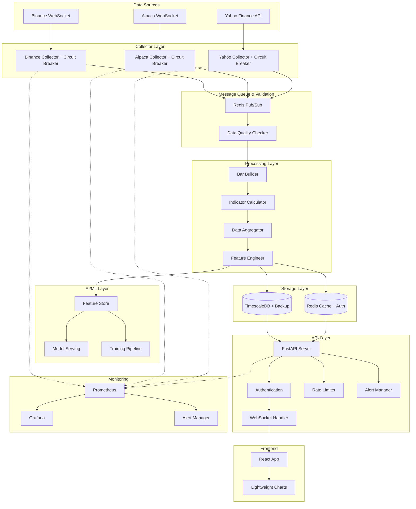

# Design Document v2.0

## Overview

Crypto-Stock Platform, mikroservis mimarisine dayalı, event-driven bir finansal veri toplama ve görselleştirme platformudur. Platform, üç farklı veri kaynağından (Binance, Alpaca, Yahoo Finance) real-time ve gecikmeli veri toplayarak, bu verileri işleyip TimescaleDB'de saklayacak, Redis üzerinden cache'leyecek ve WebSocket ile frontend'e push edecektir. v2.0'da production-ready özellikleri, AI/ML veri altyapısı, kapsamlı monitoring ve fault tolerance eklendi.

## Changelog v2.0

- ✅ AI/ML Feature Store ve model serving infrastructure eklendi
- ✅ Data Quality Checker ve validation pipeline eklendi
- ✅ Circuit Breaker Pattern implementasyonu eklendi
- ✅ Comprehensive Monitoring (Prometheus + Grafana) detaylandırıldı
- ✅ WebSocket Authentication ve Authorization eklendi
- ✅ Database Backup ve Disaster Recovery stratejisi eklendi
- ✅ API Versioning ve backward compatibility eklendi
- ✅ Real-time Alert Manager eklendi
- ✅ Configuration Management sistemi eklendi
- ✅ Rate Limiting ve Security hardening detaylandırıldı
- ✅ Backtesting Framework hazırlığı eklendi
- ✅ Enhanced Health Checks eklendi

### High-Level Architecture v2.0

```
┌──────────────────────────────────────────────────────────────────┐
│                         Data Sources                             │
│  ┌──────────┐      ┌──────────┐      ┌──────────────┐          │
│  │ Binance  │      │ Alpaca   │      │ Yahoo Finance│          │
│  │WebSocket │      │WebSocket │      │  REST API    │          │
│  └────┬─────┘      └────┬─────┘      └──────┬───────┘          │
└───────┼─────────────────┼─────────────────────┼──────────────────┘
        │                 │                    │
        ▼                 ▼                    ▼
┌──────────────────────────────────────────────────────────────────┐
│                      Collector Layer                             │
│  ┌──────────────┐  ┌──────────────┐  ┌──────────────┐          │
│  │   Binance    │  │   Alpaca     │  │    Yahoo     │          │
│  │  Collector   │  │  Collector   │  │  Collector   │          │
│  │ + Circuit    │  │ + Circuit    │  │ + Circuit    │          │
│  │   Breaker    │  │   Breaker    │  │   Breaker    │          │
│  └──────┬───────┘  └──────┬───────┘  └──────┬───────┘          │
└─────────┼──────────────────┼──────────────────┼──────────────────┘
          │                  │                  │
          └──────────────────┼──────────────────┘
                             ▼
                    ┌────────────────┐
                    │  Redis Queue   │
                    │   (Pub/Sub)    │
                    │ + Data Quality │
                    │    Checker     │
                    └────────┬───────┘
                             │
                             ▼
┌──────────────────────────────────────────────────────────────────┐
│                     Processing Layer                             │
│  ┌──────────────┐  ┌──────────────┐  ┌──────────────┐          │
│  │ Bar Builder  │  │  Indicator   │  │    Data      │          │
│  │              │─▶│  Calculator  │─▶│ Aggregator   │          │
│  │ + Validation │  │  + Features  │  │  + Quality   │          │
│  └──────────────┘  └──────────────┘  └──────┬───────┘          │
│                                              │                   │
│  ┌──────────────────────────────────────────┴───────┐          │
│  │           AI/ML Feature Engineering               │          │
│  │  ┌─────────────┐  ┌─────────────┐  ┌──────────┐ │          │
│  │  │Feature Store│  │Model Serving│  │ Training │ │          │
│  │  └─────────────┘  └─────────────┘  └──────────┘ │          │
│  └──────────────────────────────────────────────────┘          │
└──────────────────────────┬───────────────────────────────────────┘
                           │
          ┌────────────────┴──────────────────┐
          ▼                                   ▼
┌──────────────────┐                  ┌──────────────────┐
│  TimescaleDB     │                  │   Redis Cache    │
│  (Persistent)    │                  │  (Hot Data)      │
│  + Backup        │                  │  + Auth Tokens   │
└────────┬─────────┘                  └────────┬─────────┘
         │                                     │
         └───────────────┬─────────────────────┘
                         ▼
                ┌─────────────────┐
                │   FastAPI       │
                │  REST + WS      │
                │ + Auth + Rate   │
                │    Limiting     │
                └────────┬────────┘
                         │
          ┌──────────────┼──────────────┐
          ▼              ▼              ▼
┌────────────────┐ ┌───────────┐ ┌──────────────┐
│  React + TS    │ │ Prometheus│ │ Alert Manager│
│ Lightweight    │ │  Metrics  │ │   (Slack/    │
│    Charts      │ │           │ │   Email)     │
└────────────────┘ └───────────┘ └──────────────┘
```

### Design Principles

1. **Separation of Concerns**: Her component tek bir sorumluluğa sahip (collector, processor, storage, API, UI)
2. **Event-Driven Architecture**: Redis Pub/Sub ile loosely coupled components
3. **Async-First**: Python asyncio ile non-blocking I/O operations
4. **Scalability**: Horizontal scaling için stateless collectors ve processors
5. **Resilience**: Circuit breakers, automatic reconnection, graceful degradation
6. **Performance**: Redis cache, batch operations, vectorized calculations
7. **Observability**: Structured logging, Prometheus metrics, Grafana dashboards, distributed tracing
8. **Security**: Authentication, authorization, rate limiting, input validation
9. **Data Quality**: Automated validation, anomaly detection, quality metrics
10. **ML-Ready**: Feature store, model serving, real-time inference

## Architecture

### Component Diagram v2.0



## Components and Interfaces

### 1. Collector Layer with Circuit Breaker

#### Circuit Breaker Implementation

```python
# collectors/circuit_breaker.py
from enum import Enum
import time
from typing import Callable, Any
import asyncio

class CircuitState(Enum):
    CLOSED = "closed"      # Normal operation
    OPEN = "open"          # Failing, reject requests
    HALF_OPEN = "half_open"  # Testing recovery

class CircuitBreaker:
    """
    Implements circuit breaker pattern to prevent cascade failures.
    
    States:
    - CLOSED: Normal operation, requests pass through
    - OPEN: Too many failures, reject all requests
    - HALF_OPEN: After timeout, test if service recovered
    """
    
    def __init__(
        self,
        failure_threshold: int = 5,
        timeout: int = 60,
        success_threshold: int = 2,
        name: str = "default"
    ):
        self.failure_threshold = failure_threshold
        self.timeout = timeout
        self.success_threshold = success_threshold
        self.name = name
        
        self.failure_count = 0
        self.success_count = 0
        self.state = CircuitState.CLOSED
        self.opened_at = None
        
        # Metrics
        from prometheus_client import Counter, Gauge
        self.state_transitions = Counter(
            'circuit_breaker_state_transitions',
            'Circuit breaker state transitions',
            ['circuit', 'from_state', 'to_state']
        )
        self.current_state = Gauge(
            'circuit_breaker_state',
            'Current circuit breaker state',
            ['circuit']
        )
        
    async def call(self, func: Callable, *args, **kwargs) -> Any:
        """Execute function with circuit breaker protection"""
        
        if self.state == CircuitState.OPEN:
            if time.time() - self.opened_at >= self.timeout:
                logger.info(f"Circuit {self.name}: Attempting recovery (HALF_OPEN)")
                self._transition_to(CircuitState.HALF_OPEN)
            else:
                raise CircuitBreakerOpenError(
                    f"Circuit {self.name} is OPEN. "
                    f"Retry after {self.timeout - (time.time() - self.opened_at):.0f}s"
                )
        
        try:
            result = await func(*args, **kwargs)
            self._on_success()
            return result
        except Exception as e:
            self._on_failure()
            raise
    
    def _on_success(self):
        """Handle successful request"""
        if self.state == CircuitState.HALF_OPEN:
            self.success_count += 1
            if self.success_count >= self.success_threshold:
                logger.info(f"Circuit {self.name}: Service recovered (CLOSED)")
                self._transition_to(CircuitState.CLOSED)
        
        self.failure_count = 0
    
    def _on_failure(self):
        """Handle failed request"""
        self.failure_count += 1
        
        if self.state == CircuitState.HALF_OPEN:
            logger.warning(f"Circuit {self.name}: Recovery failed (OPEN)")
            self._transition_to(CircuitState.OPEN)
        elif self.failure_count >= self.failure_threshold:
            logger.error(
                f"Circuit {self.name}: Failure threshold reached "
                f"({self.failure_count}/{self.failure_threshold}) (OPEN)"
            )
            self._transition_to(CircuitState.OPEN)
    
    def _transition_to(self, new_state: CircuitState):
        """Transition to new state"""
        old_state = self.state
        self.state = new_state
        
        if new_state == CircuitState.OPEN:
            self.opened_at = time.time()
            self.success_count = 0
        elif new_state == CircuitState.CLOSED:
            self.failure_count = 0
            self.success_count = 0
        
        # Record metrics
        self.state_transitions.labels(
            circuit=self.name,
            from_state=old_state.value,
            to_state=new_state.value
        ).inc()
        
        self.current_state.labels(circuit=self.name).set(
            {"closed": 0, "open": 1, "half_open": 0.5}[new_state.value]
        )

class CircuitBreakerOpenError(Exception):
    """Raised when circuit breaker is open"""
    pass
```

#### Enhanced Base Collector

```python
# collectors/base_collector.py
from abc import ABC, abstractmethod
from typing import Dict, List, Optional
import asyncio
from .circuit_breaker import CircuitBreaker, CircuitBreakerOpenError

class BaseCollector(ABC):
    """
    Abstract base class for all data collectors.
    v2.0: Added circuit breaker, health checks, and metrics
    """
    
    def __init__(self, config: Dict, redis_client):
        self.config = config
        self.redis = redis_client
        self.is_running = False
        self.reconnect_delay = 1
        self.max_reconnect_delay = 60
        
        # Circuit breaker
        self.circuit_breaker = CircuitBreaker(
            failure_threshold=5,
            timeout=60,
            name=f"{config['exchange']}_collector"
        )
        
        # Metrics
        from prometheus_client import Counter, Histogram
        self.trades_received = Counter(
            'trades_received_total',
            'Total trades received',
            ['exchange', 'symbol']
        )
        self.connection_duration = Histogram(
            'collector_connection_duration_seconds',
            'Connection duration',
            ['exchange']
        )
        
    @abstractmethod
    async def connect(self) -> None:
        """Establish connection to data source"""
        pass
        
    @abstractmethod
    async def subscribe(self, symbols: List[str]) -> None:
        """Subscribe to symbol streams"""
        pass
        
    @abstractmethod
    async def handle_message(self, message: Dict) -> None:
        """Process incoming message"""
        pass
    
    async def connect_with_circuit_breaker(self) -> None:
        """Connect using circuit breaker protection"""
        try:
            await self.circuit_breaker.call(self.connect)
        except CircuitBreakerOpenError as e:
            logger.warning(f"Circuit breaker open: {e}")
            await asyncio.sleep(10)
            raise
        
    async def publish_trade(self, trade_data: Dict) -> None:
        """Publish trade to Redis queue"""
        # Record metric
        self.trades_received.labels(
            exchange=trade_data['exchange'],
            symbol=trade_data['symbol']
        ).inc()
        
        await self.redis.publish(
            f"trades:{self.config['exchange']}", 
            json.dumps(trade_data)
        )
        
    async def update_health_status(self, status: str, details: Dict = None):
        """Update collector health in Redis"""
        health_data = {
            'status': status,
            'exchange': self.config['exchange'],
            'timestamp': time.time(),
            'circuit_breaker_state': self.circuit_breaker.state.value,
            'details': details or {}
        }
        
        await self.redis.hset(
            'system:health',
            f"{self.config['exchange']}_collector",
            json.dumps(health_data)
        )
        
    async def start(self) -> None:
        """Start collector with auto-reconnect and circuit breaker"""
        self.is_running = True
        
        while self.is_running:
            try:
                await self.update_health_status('connecting')
                await self.connect_with_circuit_breaker()
                await self.update_health_status('connected')
                
                await self.run()
                
            except CircuitBreakerOpenError:
                await self.update_health_status('circuit_open')
                await asyncio.sleep(self.circuit_breaker.timeout)
                
            except Exception as e:
                logger.error(f"Collector error: {e}")
                await self.update_health_status('error', {'error': str(e)})
                await self.reconnect()
```

### 2. Data Quality Checker

```python
# processors/data_quality.py
from typing import Dict, Optional
import numpy as np
from collections import deque
from prometheus_client import Counter, Gauge

class DataQualityChecker:
    """
    Validates incoming trade data for quality issues.
    Detects anomalies, stale data, and invalid values.
    """
    
    def __init__(self, redis_client):
        self.redis = redis_client
        self.price_history = {}  # {symbol: deque of recent prices}
        self.window_size = 100
        
        # Quality metrics
        self.quality_checks_total = Counter(
            'data_quality_checks_total',
            'Total quality checks performed',
            ['check_type', 'result']
        )
        self.data_quality_score = Gauge(
            'data_quality_score',
            'Data quality score (0-1)',
            ['symbol']
        )
        
    async def validate_trade(self, trade: Dict) -> tuple[bool, Optional[str]]:
        """
        Validate trade data and return (is_valid, error_message).
        
        Checks:
        1. Price anomaly (sudden 10x jump)
        2. Data freshness (not stale)
        3. Valid numeric values
        4. Volume sanity check
        """
        symbol = trade['symbol']
        price = trade['price']
        volume = trade['quantity']
        timestamp = trade['timestamp']
        
        # Check 1: Price anomaly detection
        if not self._check_price_anomaly(symbol, price):
            self.quality_checks_total.labels(
                check_type='price_anomaly',
                result='failed'
            ).inc()
            return False, f"Price anomaly detected for {symbol}: {price}"
        
        # Check 2: Data freshness
        if not self._check_data_freshness(timestamp):
            self.quality_checks_total.labels(
                check_type='freshness',
                result='failed'
            ).inc()
            return False, f"Stale data: timestamp {timestamp}"
        
        # Check 3: Valid values
        if not self._check_valid_values(price, volume):
            self.quality_checks_total.labels(
                check_type='valid_values',
                result='failed'
            ).inc()
            return False, f"Invalid values: price={price}, volume={volume}"
        
        # Check 4: Volume sanity
        if not await self._check_volume_sanity(symbol, volume):
            self.quality_checks_total.labels(
                check_type='volume_sanity',
                result='failed'
            ).inc()
            return False, f"Suspicious volume for {symbol}: {volume}"
        
        # All checks passed
        self.quality_checks_total.labels(
            check_type='overall',
            result='passed'
        ).inc()
        
        # Update price history
        self._update_price_history(symbol, price)
        
        # Calculate and update quality score
        await self._update_quality_score(symbol)
        
        return True, None
    
    def _check_price_anomaly(self, symbol: str, price: float) -> bool:
        """Check if price is anomalous (>10% sudden change)"""
        if symbol not in self.price_history or len(self.price_history[symbol]) < 10:
            return True  # Not enough data to determine
        
        recent_prices = list(self.price_history[symbol])
        recent_avg = np.mean(recent_prices)
        recent_std = np.std(recent_prices)
        
        # Z-score check
        if recent_std > 0:
            z_score = abs(price - recent_avg) / recent_std
            if z_score > 3:  # 3 standard deviations
                logger.warning(
                    f"Price anomaly for {symbol}: "
                    f"price={price}, avg={recent_avg:.2f}, z_score={z_score:.2f}"
                )
                return False
        
        # Percentage change check
        pct_change = abs(price - recent_avg) / recent_avg
        if pct_change > 0.1:  # 10% threshold
            logger.warning(
                f"Large price move for {symbol}: "
                f"{pct_change*100:.1f}% change"
            )
            return False
        
        return True
    
    def _check_data_freshness(self, timestamp: int) -> bool:
        """Check if data is not stale (< 1 minute old)"""
        now = time.time() * 1000
        age_ms = now - timestamp
        
        if age_ms > 60000:  # 1 minute threshold
            logger.warning(f"Stale data: {age_ms/1000:.1f}s old")
            return False
        
        return True
    
    def _check_valid_values(self, price: float, volume: float) -> bool:
        """Check if values are valid numbers"""
        if price <= 0 or not np.isfinite(price):
            logger.warning(f"Invalid price: {price}")
            return False
        
        if volume < 0 or not np.isfinite(volume):
            logger.warning(f"Invalid volume: {volume}")
            return False
        
        return True
    
    async def _check_volume_sanity(self, symbol: str, volume: float) -> bool:
        """Check if volume is within reasonable range"""
        # Get recent average volume from Redis
        avg_volume_key = f"avg_volume:{symbol}"
        avg_volume = await self.redis.get(avg_volume_key)
        
        if avg_volume is None:
            return True  # No baseline yet
        
        avg_volume = float(avg_volume)
        
        # Check if volume is 100x average (suspicious)
        if volume > avg_volume * 100:
            logger.warning(
                f"Suspicious volume for {symbol}: "
                f"{volume} vs avg {avg_volume}"
            )
            return False
        
        return True
    
    def _update_price_history(self, symbol: str, price: float):
        """Maintain rolling window of recent prices"""
        if symbol not in self.price_history:
            self.price_history[symbol] = deque(maxlen=self.window_size)
        
        self.price_history[symbol].append(price)
    
    async def _update_quality_score(self, symbol: str):
        """Calculate and store data quality score"""
        # Simple quality score based on recent validation results
        # In production, this could be more sophisticated
        
        recent_checks = 100  # last 100 checks
        passed = self.quality_checks_total.labels(
            check_type='overall',
            result='passed'
        )._value.get()
        
        quality_score = min(1.0, passed / recent_checks) if recent_checks > 0 else 1.0
        
        self.data_quality_score.labels(symbol=symbol).set(quality_score)
        
        # Store in Redis for monitoring
        await self.redis.hset(
            'data_quality',
            symbol,
            json.dumps({
                'score': quality_score,
                'timestamp': time.time()
            })
        )
```

### 3. AI/ML Feature Store

```python
# ai/feature_store.py
from typing import Dict, List
import pandas as pd
import numpy as np
from datetime import datetime

class FeatureStore:
    """
    Manages feature engineering and storage for ML models.
    Provides both real-time and batch feature access.
    """
    
    def __init__(self, db_manager, redis_client):
        self.db = db_manager
        self.redis = redis_client
        self.feature_version = "v1.0"
        
    async def engineer_features(self, bars: List[Dict], indicators: Dict) -> Dict:
        """
        Create ML features from OHLC bars and indicators.
        
        Features include:
        - Price features: returns, log returns, price momentum
        - Volatility features: rolling std, ATR-based volatility
        - Volume features: volume momentum, volume ratio
        - Technical features: indicator crossovers, divergences
        - Time features: hour of day, day of week
        """
        df = pd.DataFrame(bars)
        
        features = {}
        
        # Price features
        features['returns_1'] = df['close'].pct_change(1)
        features['returns_5'] = df['close'].pct_change(5)
        features['returns_10'] = df['close'].pct_change(10)
        features['log_returns'] = np.log(df['close'] / df['close'].shift(1))
        
        # Price momentum
        features['price_momentum_5'] = df['close'] / df['close'].shift(5) - 1
        features['price_momentum_10'] = df['close'] / df['close'].shift(10) - 1
        
        # Volatility features
        features['volatility_5'] = df['close'].pct_change().rolling(5).std()
        features['volatility_10'] = df['close'].pct_change().rolling(10).std()
        features['volatility_20'] = df['close'].pct_change().rolling(20).std()
        
        # High-Low range (proxy for intraday volatility)
        features['hl_ratio'] = (df['high'] - df['low']) / df['close']
        features['hl_ratio_ma'] = features['hl_ratio'].rolling(5).mean()
        
        # Volume features
        features['volume_change'] = df['volume'].pct_change(1)
        features['volume_momentum'] = df['volume'] / df['volume'].rolling(5).mean()
        features['volume_ratio'] = df['volume'] / df['volume'].rolling(20).mean()
        
        # Volume-price relationship
        features['volume_price_trend'] = df['volume'] * df['close'].pct_change()
        
        # Technical indicator features
        if 'rsi_14' in indicators:
            features['rsi'] = indicators['rsi_14']
            features['rsi_oversold'] = (features['rsi'] < 30).astype(int)
            features['rsi_overbought'] = (features['rsi'] > 70).astype(int)
        
        if 'macd' in indicators and 'macd_signal' in indicators:
            features['macd'] = indicators['macd']
            features['macd_signal'] = indicators['macd_signal']
            features['macd_histogram'] = indicators['macd_hist']
            # MACD crossover
            features['macd_crossover'] = (
                (features['macd'] > features['macd_signal']).astype(int).diff()
            )
        
        if 'bb_upper' in indicators and 'bb_lower' in indicators:
            features['bb_position'] = (
                (df['close'] - indicators['bb_lower']) / 
                (indicators['bb_upper'] - indicators['bb_lower'])
            )
            features['bb_squeeze'] = (
                indicators['bb_upper'] - indicators['bb_lower']
            ) / df['close']
        
        # Time-based features
        df['datetime'] = pd.to_datetime(df['time'], unit='ms')
        features['hour'] = df['datetime'].dt.hour
        features['day_of_week'] = df['datetime'].dt.dayofweek
        features['is_market_open'] = (
            (features['hour'] >= 9.5) & (features['hour'] <= 16)
        ).astype(int)
        
        # Trend features
        features['sma_20'] = df['close'].rolling(20).mean()
        features['price_above_sma'] = (df['close'] > features['sma_20']).astype(int)
        features['distance_from_sma'] = (df['close'] - features['sma_20']) / features['sma_20']
        
        # Clean NaN values
        features = {k: v.fillna(method='bfill').fillna(0) for k, v in features.items()}
        
        return features
    
    async def store_features(self, symbol: str, timestamp: int, features: Dict):
        """Store engineered features for model training/serving"""
        
        # Store in TimescaleDB for batch training
        await self.db.insert_features(
            symbol=symbol,
            timestamp=timestamp,
            features=features,
            version=self.feature_version
        )
        
        # Store in Redis for real-time serving
        feature_key = f"features:{symbol}:latest"
        await self.redis.setex(
            feature_key,
            300,  # 5 minute TTL
            json.dumps({
                'timestamp': timestamp,
                'features': features,
                'version': self.feature_version
            })
        )
    
    async def get_features_batch(
        self,
        symbol: str,
        start_time: int,
        end_time: int
    ) -> pd.DataFrame:
        """Get features for batch training"""
        features = await self.db.get_features_range(
            symbol, start_time, end_time
        )
        return pd.DataFrame(features)
    
    async def get_features_realtime(self, symbol: str) -> Dict:
        """Get latest features for real-time inference"""
        feature_key = f"features:{symbol}:latest"
        features_json = await self.redis.get(feature_key)
        
        if features_json:
            return json.loads(features_json)
        
        # Fallback to database
        latest = await self.db.get_latest_features(symbol)
        return latest
```

### 4. Monitoring and Observability

#### Prometheus Metrics

```python
# monitoring/metrics.py
from prometheus_client import (
    Counter, Histogram, Gauge, Summary, start_http_server
)

# Collector metrics
trades_received_total = Counter(
    'trades_received_total',
    'Total number of trades received',
    ['exchange', 'symbol']
)

collector_errors_total = Counter(
    'collector_errors_total',
    'Total collector errors',
    ['exchange', 'error_type']
)

websocket_reconnections_total = Counter(
    'websocket_reconnections_total',
    'Total WebSocket reconnections',
    ['exchange']
)

collector_connection_duration = Histogram(
    'collector_connection_duration_seconds',
    'Connection duration before disconnect',
    ['exchange']
)

active_symbols = Gauge(
    'active_symbols',
    'Number of actively tracked symbols',
    ['exchange']
)

# Processing metrics
bars_completed_total = Counter(
    'bars_completed_total',
    'Total completed bars',
    ['symbol', 'timeframe']
)

bar_completion_duration = Histogram(
    'bar_completion_duration_seconds',
    'Time to complete and process a bar',
    ['symbol']
)

indicator_calculation_duration = Histogram(
    'indicator_calculation_duration_seconds',
    'Time to calculate indicators',
    ['symbol']
)

data_quality_checks_total = Counter(
    'data_quality_checks_total',
    'Total data quality checks',
    ['check_type', 'result']
)

data_quality_score = Gauge(
    'data_quality_score',
    'Data quality score per symbol',
    ['symbol']
)

# Database metrics
db_queries_total = Counter(
    'db_queries_total',
    'Total database queries',
    ['operation']
)

db_query_duration = Histogram(
    'db_query_duration_seconds',
    'Database query duration',
    ['operation']
)

db_connection_pool_size = Gauge(
    'db_connection_pool_size',
    'Database connection pool size'
)

db_connection_pool_available = Gauge(
    'db_connection_pool_available',
    'Available database connections'
)

# Cache metrics
cache_hits_total = Counter(
    'cache_hits_total',
    'Total cache hits',
    ['cache_type']
)

cache_misses_total = Counter(
    'cache_misses_total',
    'Total cache misses',
    ['cache_type']
)

cache_size = Gauge(
    'cache_size_bytes',
    'Cache size in bytes',
    ['cache_type']
)

# API metrics
http_requests_total = Counter(
    'http_requests_total',
    'Total HTTP requests',
    ['method', 'endpoint', 'status']
)

http_request_duration = Histogram(
    'http_request_duration_seconds',
    'HTTP request duration',
    ['method', 'endpoint']
)

websocket_connections = Gauge(
    'websocket_connections',
    'Current WebSocket connections',
    ['endpoint']
)

websocket_messages_sent = Counter(
    'websocket_messages_sent_total',
    'Total WebSocket messages sent',
    ['symbol']
)

rate_limit_exceeded = Counter(
    'rate_limit_exceeded_total',
    'Rate limit exceeded count',
    ['client_id']
)

# Circuit breaker metrics
circuit_breaker_state = Gauge(
    'circuit_breaker_state',
    'Circuit breaker state (0=closed, 1=open, 0.5=half-open)',
    ['circuit']
)

circuit_breaker_transitions = Counter(
    'circuit_breaker_state_transitions_total',
    'Circuit breaker state transitions',
    ['circuit', 'from_state', 'to_state']
)

# Feature engineering metrics
features_calculated_total = Counter(
    'features_calculated_total',
    'Total features calculated',
    ['symbol']
)

feature_calculation_duration = Histogram(
    'feature_calculation_duration_seconds',
    'Feature calculation duration',
    ['symbol']
)

# Start metrics server
def start_metrics_server(port: int = 9090):
    """Start Prometheus metrics HTTP server"""
    start_http_server(port)
    logger.info(f"Metrics server started on port {port}")
```

#### Grafana Dashboard Configuration

```json
// monitoring/grafana_dashboard.json
{
  "dashboard": {
    "title": "Crypto-Stock Platform",
    "panels": [
      {
        "title": "Trades Per Second",
        "targets": [
          {
            "expr": "rate(trades_received_total[1m])",
            "legendFormat": "{{exchange}}"
          }
        ]
      },
      {
        "title": "Bar Completion Latency (p95)",
        "targets": [
          {
            "expr": "histogram_quantile(0.95, bar_completion_duration_seconds_bucket)",
            "legendFormat": "{{symbol}}"
          }
        ]
      },
      {
        "title": "Data Quality Score",
        "targets": [
          {
            "expr": "data_quality_score",
            "legendFormat": "{{symbol}}"
          }
        ]
      },
      {
        "title": "Circuit Breaker States",
        "targets": [
          {
            "expr": "circuit_breaker_state",
            "legendFormat": "{{circuit}}"
          }
        ]
      },
      {
        "title": "API Request Rate",
        "targets": [
          {
            "expr": "rate(http_requests_total[1m])",
            "legendFormat": "{{endpoint}} {{status}}"
          }
        ]
      },
      {
        "title": "Cache Hit Rate",
        "targets": [
          {
            "expr": "rate(cache_hits_total[5m]) / (rate(cache_hits_total[5m]) + rate(cache_misses_total[5m]))",
            "legendFormat": "{{cache_type}}"
          }
        ]
      },
      {
        "title": "WebSocket Connections",
        "targets": [
          {
            "expr": "websocket_connections",
            "legendFormat": "{{endpoint}}"
          }
        ]
      },
      {
        "title": "Database Query Latency (p99)",
        "targets": [
          {
            "expr": "histogram_quantile(0.99, db_query_duration_seconds_bucket)",
            "legendFormat": "{{operation}}"
          }
        ]
      }
    ]
  }
}
```

### 5. Authentication and Authorization

```python
# api/auth.py
from fastapi import HTTPException, Security, WebSocket, status
from fastapi.security import HTTPBearer, HTTPAuthorizationCredentials
from jose import jwt, JWTError
from datetime import datetime, timedelta
from typing import Optional
import secrets

security = HTTPBearer()

SECRET_KEY = os.getenv("JWT_SECRET_KEY")
ALGORITHM = "HS256"
ACCESS_TOKEN_EXPIRE_MINUTES = 60

class AuthManager:
    """Manages JWT authentication and authorization"""
    
    def create_access_token(
        self,
        data: dict,
        expires_delta: Optional[timedelta] = None
    ) -> str:
        """Create JWT access token"""
        to_encode = data.copy()
        
        if expires_delta:
            expire = datetime.utcnow() + expires_delta
        else:
            expire = datetime.utcnow() + timedelta(minutes=ACCESS_TOKEN_EXPIRE_MINUTES)
        
        to_encode.update({"exp": expire})
        encoded_jwt = jwt.encode(to_encode, SECRET_KEY, algorithm=ALGORITHM)
        
        return encoded_jwt
    
    def verify_token(self, token: str) -> dict:
        """Verify and decode JWT token"""
        try:
            payload = jwt.decode(token, SECRET_KEY, algorithms=[ALGORITHM])
            return payload
        except JWTError:
            raise HTTPException(
                status_code=status.HTTP_401_UNAUTHORIZED,
                detail="Could not validate credentials"
            )
    
    def get_current_user(
        self,
        credentials: HTTPAuthorizationCredentials = Security(security)
    ) -> dict:
        """Get current user from token"""
        token = credentials.credentials
        payload = self.verify_token(token)
        
        user_id = payload.get("sub")
        if user_id is None:
            raise HTTPException(
                status_code=status.HTTP_401_UNAUTHORIZED,
                detail="Invalid authentication credentials"
            )
        
        return {
            "user_id": user_id,
            "email": payload.get("email"),
            "roles": payload.get("roles", [])
        }
    
    def check_permission(self, user: dict, required_role: str) -> bool:
        """Check if user has required role"""
        return required_role in user.get("roles", [])

auth_manager = AuthManager()

# WebSocket authentication
async def authenticate_websocket(
    websocket: WebSocket,
    token: Optional[str] = None
) -> Optional[dict]:
    """Authenticate WebSocket connection"""
    if not token:
        await websocket.close(code=4001, reason="Missing authentication token")
        return None
    
    try:
        payload = auth_manager.verify_token(token)
        return {
            "user_id": payload.get("sub"),
            "email": payload.get("email"),
            "roles": payload.get("roles", [])
        }
    except:
        await websocket.close(code=4001, reason="Invalid authentication token")
        return None

# Protected endpoints
@app.get("/api/v1/charts/{symbol}")
async def get_chart_data(
    symbol: str,
    user: dict = Depends(auth_manager.get_current_user)
):
    """Protected endpoint - requires authentication"""
    # ... implementation
    pass

# WebSocket with authentication
@app.websocket("/ws/{symbol}")
async def websocket_endpoint(
    websocket: WebSocket,
    symbol: str,
    token: str = Query(...)
):
    """Authenticated WebSocket endpoint"""
    user = await authenticate_websocket(websocket, token)
    if not user:
        return
    
    await manager.connect(websocket, symbol, user['user_id'])
    # ... rest of implementation
```

### 6. Rate Limiting

```python
# api/rate_limiter.py
from fastapi import HTTPException, Request
from slowapi import Limiter
from slowapi.util import get_remote_address
from slowapi.errors import RateLimitExceeded
from redis.asyncio import Redis
import time

limiter = Limiter(key_func=get_remote_address)

class TokenBucketRateLimiter:
    """Token bucket rate limiter with Redis backend"""
    
    def __init__(self, redis_client: Redis, rate: int, period: int):
        self.redis = redis_client
        self.rate = rate  # tokens per period
        self.period = period  # seconds
        
    async def is_allowed(self, client_id: str) -> bool:
        """Check if request is allowed"""
        key = f"rate_limit:{client_id}"
        
        # Get current tokens and last refill time
        pipe = self.redis.pipeline()
        pipe.hget(key, "tokens")
        pipe.hget(key, "last_refill")
        result = await pipe.execute()
        
        tokens = float(result[0]) if result[0] else self.rate
        last_refill = float(result[1]) if result[1] else time.time()
        
        # Refill tokens based on elapsed time
        now = time.time()
        elapsed = now - last_refill
        tokens = min(self.rate, tokens + (elapsed * self.rate / self.period))
        
        # Check if we have tokens available
        if tokens >= 1:
            tokens -= 1
            
            # Update Redis
            pipe = self.redis.pipeline()
            pipe.hset(key, "tokens", str(tokens))
            pipe.hset(key, "last_refill", str(now))
            pipe.expire(key, self.period * 2)
            await pipe.execute()
            
            return True
        
        return False

# Rate limiter middleware
@app.middleware("http")
async def rate_limit_middleware(request: Request, call_next):
    """Apply rate limiting to all requests"""
    
    # Skip rate limiting for health checks
    if request.url.path == "/api/health":
        return await call_next(request)
    
    # Get client identifier
    client_id = get_remote_address(request)
    
    # Check if user is authenticated, use user_id as identifier
    auth_header = request.headers.get("authorization")
    if auth_header:
        try:
            token = auth_header.split(" ")[1]
            payload = auth_manager.verify_token(token)
            client_id = payload.get("sub")
        except:
            pass
    
    # Check rate limit
    rate_limiter = TokenBucketRateLimiter(
        redis_client=redis_manager.client,
        rate=100,  # 100 requests
        period=60  # per minute
    )
    
    if not await rate_limiter.is_allowed(client_id):
        from prometheus_client import Counter
        rate_limit_exceeded = Counter(
            'rate_limit_exceeded_total',
            'Rate limit exceeded',
            ['client_id']
        )
        rate_limit_exceeded.labels(client_id=client_id).inc()
        
        raise HTTPException(
            status_code=429,
            detail="Rate limit exceeded. Please try again later."
        )
    
    response = await call_next(request)
    return response
```

### 7. Alert Manager

```python
# api/alert_manager.py
from typing import Dict, List, Callable
import asyncio
from enum import Enum

class AlertCondition(Enum):
    PRICE_ABOVE = "price_above"
    PRICE_BELOW = "price_below"
    RSI_ABOVE = "rsi_above"
    RSI_BELOW = "rsi_below"
    MACD_CROSSOVER = "macd_crossover"
    VOLUME_SPIKE = "volume_spike"

class AlertChannel(Enum):
    WEBSOCKET = "websocket"
    EMAIL = "email"
    WEBHOOK = "webhook"
    SLACK = "slack"

class Alert:
    """Represents a price/indicator alert"""
    
    def __init__(
        self,
        alert_id: str,
        user_id: str,
        symbol: str,
        condition: AlertCondition,
        threshold: float,
        channels: List[AlertChannel],
        one_time: bool = True,
        cooldown_seconds: int = 300
    ):
        self.alert_id = alert_id
        self.user_id = user_id
        self.symbol = symbol
        self.condition = condition
        self.threshold = threshold
        self.channels = channels
        self.one_time = one_time
        self.cooldown_seconds = cooldown_seconds
        self.last_triggered = None
        self.is_active = True
    
    def should_trigger(self, data: Dict) -> bool:
        """Check if alert condition is met"""
        if not self.is_active:
            return False
        
        # Check cooldown
        if self.last_triggered:
            elapsed = time.time() - self.last_triggered
            if elapsed < self.cooldown_seconds:
                return False
        
        # Check condition
        if self.condition == AlertCondition.PRICE_ABOVE:
            return data.get('close', 0) > self.threshold
        
        elif self.condition == AlertCondition.PRICE_BELOW:
            return data.get('close', 0) < self.threshold
        
        elif self.condition == AlertCondition.RSI_ABOVE:
            return data.get('rsi_14', 0) > self.threshold
        
        elif self.condition == AlertCondition.RSI_BELOW:
            return data.get('rsi_14', 0) < self.threshold
        
        elif self.condition == AlertCondition.MACD_CROSSOVER:
            macd = data.get('macd', 0)
            signal = data.get('macd_signal', 0)
            prev_macd = data.get('prev_macd', 0)
            prev_signal = data.get('prev_macd_signal', 0)
            
            # Bullish crossover
            if self.threshold > 0:
                return prev_macd <= prev_signal and macd > signal
            # Bearish crossover
            else:
                return prev_macd >= prev_signal and macd < signal
        
        elif self.condition == AlertCondition.VOLUME_SPIKE:
            volume = data.get('volume', 0)
            avg_volume = data.get('volume_sma', 1)
            return volume > avg_volume * self.threshold
        
        return False

class AlertManager:
    """Manages user alerts and notifications"""
    
    def __init__(self, db_manager, redis_client):
        self.db = db_manager
        self.redis = redis_client
        self.alerts: Dict[str, List[Alert]] = {}  # {symbol: [alerts]}
        self.notification_handlers = {}
        
    async def load_alerts(self):
        """Load active alerts from database"""
        alerts = await self.db.get_active_alerts()
        
        for alert_data in alerts:
            alert = Alert(**alert_data)
            if alert.symbol not in self.alerts:
                self.alerts[alert.symbol] = []
            self.alerts[alert.symbol].append(alert)
        
        logger.info(f"Loaded {len(alerts)} active alerts")
    
    async def create_alert(self, alert: Alert):
        """Create new alert"""
        await self.db.insert_alert(alert)
        
        if alert.symbol not in self.alerts:
            self.alerts[alert.symbol] = []
        self.alerts[alert.symbol].append(alert)
        
        logger.info(f"Created alert {alert.alert_id} for {alert.symbol}")
    
    async def check_alerts(self, symbol: str, data: Dict):
        """Check if any alerts should trigger"""
        if symbol not in self.alerts:
            return
        
        triggered_alerts = []
        
        for alert in self.alerts[symbol]:
            if alert.should_trigger(data):
                triggered_alerts.append(alert)
                
                # Update alert state
                alert.last_triggered = time.time()
                if alert.one_time:
                    alert.is_active = False
                
                # Send notifications
                await self._send_notifications(alert, data)
        
        # Update database
        for alert in triggered_alerts:
            await self.db.update_alert(alert)
    
    async def _send_notifications(self, alert: Alert, data: Dict):
        """Send notifications via configured channels"""
        message = self._format_alert_message(alert, data)
        
        for channel in alert.channels:
            if channel == AlertChannel.WEBSOCKET:
                await self._send_websocket_notification(alert, message)
            
            elif channel == AlertChannel.EMAIL:
                await self._send_email_notification(alert, message)
            
            elif channel == AlertChannel.WEBHOOK:
                await self._send_webhook_notification(alert, message)
            
            elif channel == AlertChannel.SLACK:
                await self._send_slack_notification(alert, message)
    
    def _format_alert_message(self, alert: Alert, data: Dict) -> str:
        """Format alert message"""
        return (
            f"Alert triggered for {alert.symbol}\n"
            f"Condition: {alert.condition.value}\n"
            f"Threshold: {alert.threshold}\n"
            f"Current value: {data.get('close', 'N/A')}\n"
            f"Time: {datetime.now().isoformat()}"
        )
    
    async def _send_websocket_notification(self, alert: Alert, message: str):
        """Send notification via WebSocket"""
        notification = {
            "type": "alert",
            "alert_id": alert.alert_id,
            "message": message
        }
        
        # Publish to user's notification channel
        await self.redis.publish(
            f"notifications:{alert.user_id}",
            json.dumps(notification)
        )
    
    async def _send_email_notification(self, alert: Alert, message: str):
        """Send notification via email"""
        # Implementation depends on email service (SendGrid, AWS SES, etc.)
        pass
    
    async def _send_webhook_notification(self, alert: Alert, message: str):
        """Send notification via webhook"""
        # HTTP POST to user's webhook URL
        pass
    
    async def _send_slack_notification(self, alert: Alert, message: str):
        """Send notification via Slack"""
        # POST to Slack webhook URL
        pass
```

### 8. Configuration Management

```yaml
# config/exchanges.yaml
exchanges:
  binance:
    enabled: true
    type: websocket
    symbols:
      - BTC/USDT
      - ETH/USDT
      - SOL/USDT
      - BNB/USDT
      - ADA/USDT
    timeframes:
      - 1m
      - 5m
      - 15m
      - 1h
    rate_limits:
      rest_api: 1200  # requests per minute
      websocket_connections: 300
    circuit_breaker:
      failure_threshold: 5
      timeout: 60
      success_threshold: 2
    reconnect:
      initial_delay: 1
      max_delay: 60
      multiplier: 2
  
  alpaca:
    enabled: true
    type: websocket
    symbols:
      - AAPL
      - TSLA
      - NVDA
      - MSFT
      - GOOGL
      - AMZN
      - META
    data_feed: iex  # or 'sip'
    market_hours:
      timezone: US/Eastern
      open: "09:30"
      close: "16:00"
      days: [0, 1, 2, 3, 4]  # Monday-Friday
    circuit_breaker:
      failure_threshold: 5
      timeout: 60
      success_threshold: 2
  
  yahoo:
    enabled: true
    type: polling
    symbols:
      - THYAO.IS
      - GARAN.IS
      - ISCTR.IS
      - AKBNK.IS
      - SISE.IS
    polling_interval: 300  # seconds
    market_hours:
      timezone: Europe/Istanbul
      open: "09:40"
      close: "18:10"
      days: [0, 1, 2, 3, 4]
    circuit_breaker:
      failure_threshold: 3
      timeout: 300
```

```python
# config/config_manager.py
import yaml
from typing import Dict
import asyncio
from watchdog.observers import Observer
from watchdog.events import FileSystemEventHandler

class ConfigManager:
    """
    Manages dynamic configuration with hot-reload support.
    Watches config files and reloads on changes.
    """
    
    def __init__(self, config_path: str):
        self.config_path = config_path
        self.config = {}
        self.callbacks = []
        
    def load_config(self) -> Dict:
        """Load configuration from YAML file"""
        with open(self.config_path, 'r') as f:
            self.config = yaml.safe_load(f)
        
        logger.info(f"Loaded configuration from {self.config_path}")
        return self.config
    
    def get(self, key: str, default=None):
        """Get configuration value"""
        keys = key.split('.')
        value = self.config
        
        for k in keys:
            if isinstance(value, dict):
                value = value.get(k)
            else:
                return default
        
        return value if value is not None else default
    
    def register_reload_callback(self, callback):
        """Register callback to be called on config reload"""
        self.callbacks.append(callback)
    
    async def on_config_change(self):
        """Called when config file changes"""
        logger.info("Configuration file changed, reloading...")
        
        try:
            self.load_config()
            
            # Notify all registered callbacks
            for callback in self.callbacks:
                await callback(self.config)
            
            logger.info("Configuration reloaded successfully")
        
        except Exception as e:
            logger.error(f"Failed to reload configuration: {e}")
    
    def start_watching(self):
        """Start watching config file for changes"""
        event_handler = ConfigFileHandler(self)
        observer = Observer()
        observer.schedule(
            event_handler,
            path=os.path.dirname(self.config_path),
            recursive=False
        )
        observer.start()
        logger.info(f"Watching {self.config_path} for changes")

class ConfigFileHandler(FileSystemEventHandler):
    """Handles config file change events"""
    
    def __init__(self, config_manager: ConfigManager):
        self.config_manager = config_manager
    
    def on_modified(self, event):
        if event.src_path == self.config_manager.config_path:
            asyncio.create_task(self.config_manager.on_config_change())
```

## Database Schema v2.0

```sql
-- Enhanced schema with additional tables

-- Candles table (unchanged)
CREATE TABLE candles (
    time TIMESTAMPTZ NOT NULL,
    symbol VARCHAR(20) NOT NULL,
    exchange VARCHAR(20) NOT NULL,
    timeframe VARCHAR(5) NOT NULL,
    open NUMERIC(20,8),
    high NUMERIC(20,8),
    low NUMERIC(20,8),
    close NUMERIC(20,8),
    volume NUMERIC(20,8),
    PRIMARY KEY (time, symbol, exchange, timeframe)
);

SELECT create_hypertable('candles', 'time');
CREATE INDEX idx_candles_symbol_time ON candles (symbol, time DESC);

-- Indicators table (unchanged)
CREATE TABLE indicators (
    time TIMESTAMPTZ NOT NULL,
    symbol VARCHAR(20) NOT NULL,
    rsi_14 NUMERIC(10,4),
    macd NUMERIC(10,4),
    macd_signal NUMERIC(10,4),
    macd_hist NUMERIC(10,4),
    bb_upper NUMERIC(20,8),
    bb_middle NUMERIC(20,8),
    bb_lower NUMERIC(20,8),
    sma_20 NUMERIC(20,8),
    sma_50 NUMERIC(20,8),
    ema_12 NUMERIC(20,8),
    ema_26 NUMERIC(20,8),
    volume_sma NUMERIC(20,8),
    stoch_k NUMERIC(10,4),
    stoch_d NUMERIC(10,4),
    PRIMARY KEY (time, symbol)
);

SELECT create_hypertable('indicators', 'time');

-- NEW: ML Features table
CREATE TABLE ml_features (
    time TIMESTAMPTZ NOT NULL,
    symbol VARCHAR(20) NOT NULL,
    feature_version VARCHAR(10) NOT NULL,
    returns_1 NUMERIC(10,6),
    returns_5 NUMERIC(10,6),
    volatility_5 NUMERIC(10,6),
    volume_momentum NUMERIC(10,6),
    rsi_zone INTEGER,
    macd_crossover INTEGER,
    bb_position NUMERIC(10,6),
    features_json JSONB,  -- Additional features
    PRIMARY KEY (time, symbol, feature_version)
);

SELECT create_hypertable('ml_features', 'time');
CREATE INDEX idx_features_symbol ON ml_features (symbol, time DESC);
CREATE INDEX idx_features_version ON ml_features (feature_version);

-- NEW: Alerts table
CREATE TABLE alerts (
    alert_id UUID PRIMARY KEY,
    user_id VARCHAR(50) NOT NULL,
    symbol VARCHAR(20) NOT NULL,
    condition VARCHAR(30) NOT NULL,
    threshold NUMERIC(20,8) NOT NULL,
    channels TEXT[] NOT NULL,
    one_time BOOLEAN DEFAULT TRUE,
    cooldown_seconds INTEGER DEFAULT 300,
    is_active BOOLEAN DEFAULT TRUE,
    last_triggered TIMESTAMPTZ,
    created_at TIMESTAMPTZ DEFAULT NOW(),
    updated_at TIMESTAMPTZ DEFAULT NOW()
);

CREATE INDEX idx_alerts_user ON alerts (user_id);
CREATE INDEX idx_alerts_symbol ON alerts (symbol) WHERE is_active = TRUE;

-- NEW: Data quality metrics
CREATE TABLE data_quality_metrics (
    time TIMESTAMPTZ NOT NULL,
    symbol VARCHAR(20) NOT NULL,
    exchange VARCHAR(20) NOT NULL,
    quality_score NUMERIC(3,2),
    checks_passed INTEGER,
    checks_failed INTEGER,
    anomalies_detected INTEGER,
    metrics_json JSONB,
    PRIMARY KEY (time, symbol, exchange)
);

SELECT create_hypertable('data_quality_metrics', 'time');

-- NEW: Audit log
CREATE TABLE audit_log (
    id SERIAL PRIMARY KEY,
    timestamp TIMESTAMPTZ DEFAULT NOW(),
    user_id VARCHAR(50),
    action VARCHAR(50) NOT NULL,
    resource_type VARCHAR(50),
    resource_id VARCHAR(100),
    details JSONB,
    ip_address VARCHAR(45)
);

CREATE INDEX idx_audit_timestamp ON audit_log (timestamp DESC);
CREATE INDEX idx_audit_user ON audit_log (user_id);

-- Retention policies
SELECT add_retention_policy('candles', INTERVAL '365 days');
SELECT add_retention_policy('indicators', INTERVAL '365 days');
SELECT add_retention_policy('ml_features', INTERVAL '365 days');
SELECT add_retention_policy('data_quality_metrics', INTERVAL '90 days');
SELECT add_retention_policy('audit_log', INTERVAL '90 days');
```

## Deployment v2.0

```yaml
# docker-compose.v2.yml
version: '3.8'

services:
  timescaledb:
    image: timescale/timescaledb:latest-pg15
    environment:
      POSTGRES_DB: crypto_stock
      POSTGRES_USER: admin
      POSTGRES_PASSWORD: ${DB_PASSWORD}
    volumes:
      - timescale_data:/var/lib/postgresql/data
      - ./database/init.sql:/docker-entrypoint-initdb.d/init.sql
    ports:
      - "5432:5432"
    healthcheck:
      test: ["CMD-SHELL", "pg_isready -U admin"]
      interval: 10s
      timeout: 5s
      retries: 5

  redis:
    image: redis:7-alpine
    command: redis-server --appendonly yes --maxmemory 2gb --maxmemory-policy allkeys-lru
    ports:
      - "6379:6379"
    volumes:
      - redis_data:/data
    healthcheck:
      test: ["CMD", "redis-cli", "ping"]
      interval: 10s
      timeout: 3s
      retries: 5

  binance_collector:
    build:
      context: .
      dockerfile: docker/Dockerfile.collector
    environment:
      COLLECTOR_TYPE: binance
      BINANCE_API_KEY: ${BINANCE_API_KEY}
      BINANCE_API_SECRET: ${BINANCE_API_SECRET}
      REDIS_HOST: redis
      DB_HOST: timescaledb
    depends_on:
      redis:
        condition: service_healthy
      timescaledb:
        condition: service_healthy
    restart: unless-stopped
    deploy:
      resources:
        limits:
          memory: 2G

  processor:
    build:
      context: .
      dockerfile: docker/Dockerfile.processor
    environment:
      REDIS_HOST: redis
      DB_HOST: timescaledb
    depends_on:
      - redis
      - timescaledb
    restart: unless-stopped
    deploy:
      replicas: 2  # Scale processors
      resources:
        limits:
          memory: 2G

  api:
    build:
      context: .
      dockerfile: docker/Dockerfile.api
    environment:
      REDIS_HOST: redis
      DB_HOST: timescaledb
      JWT_SECRET_KEY: ${JWT_SECRET_KEY}
    ports:
      - "8000:8000"
    depends_on:
      - redis
      - timescaledb
    restart: unless-stopped
    healthcheck:
      test: ["CMD", "curl", "-f", "http://localhost:8000/api/health"]
      interval: 30s
      timeout: 10s
      retries: 3

  prometheus:
    image: prom/prometheus:latest
    volumes:
      - ./monitoring/prometheus.yml:/etc/prometheus/prometheus.yml
      - prometheus_data:/prometheus
    ports:
      - "9090:9090"
    command:
      - '--config.file=/etc/prometheus/prometheus.yml'
      - '--storage.tsdb.path=/prometheus'
    restart: unless-stopped

  grafana:
    image: grafana/grafana:latest
    environment:
      GF_SECURITY_ADMIN_PASSWORD: ${GRAFANA_PASSWORD}
    volumes:
      - grafana_data:/var/lib/grafana
      - ./monitoring/grafana/dashboards:/etc/grafana/provisioning/dashboards
    ports:
      - "3001:3000"
    depends_on:
      - prometheus
    restart: unless-stopped

  alertmanager:
    image: prom/alertmanager:latest
    volumes:
      - ./monitoring/alertmanager.yml:/etc/alertmanager/alertmanager.yml
    ports:
      - "9093:9093"
    command:
      - '--config.file=/etc/alertmanager/alertmanager.yml'
    restart: unless-stopped

  # Database backup service
  backup:
    image: prodrigestivill/postgres-backup-local
    environment:
      POSTGRES_HOST: timescaledb
      POSTGRES_DB: crypto_stock
      POSTGRES_USER: admin
      POSTGRES_PASSWORD: ${DB_PASSWORD}
      SCHEDULE: "0 2 * * *"  # Daily at 2 AM
      BACKUP_KEEP_DAYS: 7
      BACKUP_KEEP_WEEKS: 4
      BACKUP_KEEP_MONTHS: 6
    volumes:
      - ./backups:/backups
    depends_on:
      - timescaledb
    restart: unless-stopped

  frontend:
    build:
      context: ./frontend
      dockerfile: Dockerfile
    ports:
      - "3000:80"
    depends_on:
      - api
    restart: unless-stopped

  nginx:
    image: nginx:alpine
    volumes:
      - ./nginx/nginx.conf:/etc/nginx/nginx.conf
    ports:
      - "80:80"
      - "443:443"
    depends_on:
      - api
      - frontend
    restart: unless-stopped

volumes:
  timescale_data:
  redis_data:
  prometheus_data:
  grafana_data:
```

## Testing Strategy v2.0

### Performance Benchmarks

```python
# tests/performance/benchmark.py
import pytest
import asyncio
import time
from locust import HttpUser, task, between

class APIUser(HttpUser):
    """Load testing for API endpoints"""
    wait_time = between(1, 3)
    
    @task
    def get_chart_data(self):
        self.client.get("/api/v1/charts/BTC/USDT?timeframe=1m&limit=1000")
    
    @task(3)
    def get_symbols(self):
        self.client.get("/api/v1/symbols")

@pytest.mark.benchmark
async def test_bar_completion_performance():
    """Test bar completion performance"""
    bar_builder = BarBuilder(mock_redis, mock_db)
    
    trades = [generate_test_trade() for _ in range(10000)]
    
    start = time.time()
    for trade in trades:
        await bar_builder.process_trade(trade)
    duration = time.time() - start
    
    assert duration < 10  # Should process 10k trades in < 10 seconds
    print(f"Processed {len(trades)} trades in {duration:.2f}s")
    print(f"Throughput: {len(trades)/duration:.0f} trades/sec")

@pytest.mark.benchmark
async def test_indicator_calculation_performance():
    """Test indicator calculation performance"""
    calculator = IndicatorCalculator(mock_redis, mock_db)
    bars = [generate_test_bar() for _ in range(200)]
    
    start = time.time()
    indicators = calculator._calculate_all_indicators(pd.DataFrame(bars))
    duration = time.time() - start
    
    assert duration < 0.2  # Should calculate in < 200ms
    print(f"Calculated indicators for {len(bars)} bars in {duration*1000:.0f}ms")
```

## Documentation Requirements v2.0

### Additional Documentation Files

1. **MONITORING.md** - Complete monitoring setup guide
2. **SECURITY.md** - Security best practices and policies
3. **ML_FEATURES.md** - Feature engineering guide for data scientists
4. **ALERTS.md** - Alert system usage and API reference
5. **PERFORMANCE_TUNING.md** - Performance optimization guide
6. **DISASTER_RECOVERY.md** - Backup and recovery procedures
7. **API_CHANGELOG.md** - API version history and migration guides

---

This v2.0 design document provides a production-ready, scalable, and maintainable architecture with comprehensive monitoring, security, and ML capabilities. The platform is now ready for enterprise deployment and future AI/ML integration.
